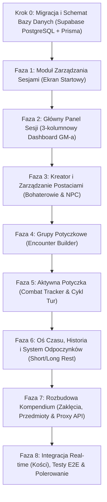

# Plan Implementacji Aplikacji Game Master Tracker (D&D 5e / TableOps)

> Dokument przygotowany na podstawie specyfikacji technicznej, schematu bazy danych oraz historyjek użytkownika zawartych w katalogu `user-stories-and-spec/`.  
> Wszystkie moduły są podzielone na małe, weryfikowalne kroki (chunki) z precyzyjnymi kryteriami testowymi.  
> **Standard wizualny:** Kontynuacja istniejącego, dopracowanego stylu dark-mode / glassmorphism (`#090d16`, akcenty `indigo`/`amber`, Tailwind CSS v4, biblioteka ikon `lucide-react`, panele `glass-card`).

---

## 🎨 Wytyczne Spójności Wizualnej (Design System)

Wszystkie nowe widoki i komponenty **muszą** ściśle bazować na dotychczas zaimplementowanym stylu w [`src/app/globals.css`](file:///Users/lukaszkosobucki/Documents/table-ops/src/app/globals.css) i [`src/components/MainDashboard.tsx`](file:///Users/lukaszkosobucki/Documents/table-ops/src/components/MainDashboard.tsx):

* **Tło i paleta bazowa:** Głęboka czerń/granat `#090d16` (background), `#0f172a` (karty i panele), obramowania `border-slate-800/80` lub `border-slate-700/60`.
* **Kolory wiodące (Akcenty):**
  * **Primary (Magia / System):** Indigo (`#6366f1` / `bg-gradient-to-r from-indigo-600 to-indigo-700`).
  * **Accent (Mistrz Gry / D&D / Ogień):** Amber/Gold (`#d97706` / `text-amber-400`).
  * **Wskaźniki stanu życia:**
    * Żywy / Zdolny do walki: szmaragdowa kropka `w-2.5 h-2.5 rounded-full bg-emerald-500 shadow-sm shadow-emerald-500/50`.
    * Nieprzytomny / Martwy (HP = 0): czerwony badge `text-rose-400 bg-rose-500/10 border border-rose-500/30` z ikoną czaszki (`Skull`).
* **Efekty szkła (Glassmorphism):**
  * `.glass-panel`: `bg-slate-900/75 backdrop-blur-md border border-white/5`.
  * `.glass-card`: `bg-slate-800/60 backdrop-blur-sm border border-white/5 hover:border-indigo-500/40 hover:shadow-indigo-500/10`.
* **Typografia i dane:** Bezszeryfowy tekst podstawowy (`font-sans`), dane mechaniczne (statystyki, rzuty kośćmi, modyfikatory, obrażenia, logi czasu) w kroju `font-mono`.
* **Responsywność:** 3-kolumnowy kokpit GM-a na dużych ekranach, który na mniejszych ekranach składa się w intuicyjne zakładki lub wysuwane panele boczne (Drawers).

---

## 🗺️ Mapa Drogowa Implementacji (Roadmap)

---

## KROK 0: Aktualizacja Schematu Bazy Danych (Supabase PostgreSQL + Prisma)

*Cel:* Zsynchronizowanie pliku [`prisma/schema.prisma`](file:///Users/lukaszkosobucki/Documents/table-ops/prisma/schema.prisma) ze specyfikacją [`user-stories-and-spec/schemat_bazy_danych.md`](file:///Users/lukaszkosobucki/Documents/table-ops/user-stories-and-spec/schemat_bazy_danych.md) oraz bazą Supabase (PostgreSQL). Głównym korzeniem logiki staje się encja `Session`.

### Chunk 0.1: Modele Sesji, Postaci i Potyczek w Prisma (✅ Zakończone)
* **Backend:**
  * Utworzenie modelu `Session` (`id`, `name`, `createdAt`, `updatedAt`).
  * Aktualizacja modelu `Character` (`sessionId`, `type` [HERO/NPC], `name`, `class`, `level`, `maxHp`, `currentHp`, `ac`, `stats` [JSON], `proficiencies` [JSON], `traits` [JSON], `inventory` [JSON], `spells` [JSON]).
  * Dodanie modeli grup potyczkowych: `EncounterGroup` (`id`, `sessionId`, `name`) oraz `EncounterMember` (`id`, `groupId`, `characterId?`, `apiMonsterId?`, `count`).
  * Dodanie modeli aktywnej walki: `Combat` (`id`, `sessionId`, `status` [PREPARING/ACTIVE/FINISHED], `currentRound`, `currentTurnIndex`, `createdAt`, `endedAt`), `Combatant` (`id`, `combatId`, `characterId?`, `apiMonsterId?`, `nameOverride`, `initiative`, `currentHp`, `maxHp`, `ac`, `order`), `CombatStatus` (`id`, `combatantId`, `statusName`, `durationTurns`).
  * Dodanie modelu historii: `SessionLog` (`id`, `sessionId`, `combatId?`, `logType` [REST_SHORT/REST_LONG/COMBAT_END/SPELL_CAST/COMBAT_ACTION], `description`, `metadata` [JSON], `createdAt`).
  * Zachowanie i powiązanie z istniejącym modelem `Monster`.
  * Dodanie indeksów na kluczach obcych (`@@index`) wg wytycznych wydajności Supabase PostgreSQL.
* **Weryfikacja / Testy:**
  * Wykonanie `npm run prisma:generate`.
  * Weryfikacja poprawności generowanych typów TypeScript w `node_modules/@prisma/client` oraz test w [`src/lib/prisma-schema.test.ts`](file:///Users/lukaszkosobucki/Documents/table-ops/src/lib/prisma-schema.test.ts).
  * Wykonanie pełnego suite testów Vitest, lintera Biome oraz Next.js build.

---

## FAZA 1: Moduł Zarządzania Sesjami (Ekran Startowy)
*User Stories:* [`user-stories-and-spec/user_stories_modu_sesji.md`](file:///Users/lukaszkosobucki/Documents/table-ops/user-stories-and-spec/user_stories_modu_sesji.md)  
*API Spec:* [`user-stories-and-spec/wymagania_crud_api.md`](file:///Users/lukaszkosobucki/Documents/table-ops/user-stories-and-spec/wymagania_crud_api.md) (Sekcja 1)

### Chunk 1.1: Backend – CRUD Sesji (✅ Zakończone)
* **Backend:**
  * Moduł domeny [`src/lib/sessions.ts`](file:///Users/lukaszkosobucki/Documents/table-ops/src/lib/sessions.ts) z walidacją nazwy (min. 2, max. 60 znaków), funkcjami `getSessions`, `createSession`, `updateSession`, `deleteSession` oraz wstrzykiwaniem klienta Prisma (DI).
  * Endpoint `GET /api/sessions`: zwraca listę sesji posortowaną po `updatedAt DESC` wraz z zagregowaną liczbą przypisanych postaci i logów (`_count: { characters, sessionLogs }`).
  * Endpoint `POST /api/sessions`: walidacja nazwy i utworzenie nowej sesji (HTTP 201).
  * Endpoint `PUT /api/sessions/[id]`: aktualizacja nazwy sesji z obsługą błędu 404 (HTTP 200).
  * Endpoint `DELETE /api/sessions/[id]`: usunięcie sesji z obsługą błędu 404 i kaskadowym usuwaniem powiązanych danych (HTTP 200).
* **Testowanie:**
  * Testy jednostkowe logiki i walidacji w [`src/lib/sessions.test.ts`](file:///Users/lukaszkosobucki/Documents/table-ops/src/lib/sessions.test.ts).
  * Testy integracyjne endpointów w [`src/app/api/sessions/sessions-api.test.ts`](file:///Users/lukaszkosobucki/Documents/table-ops/src/app/api/sessions/sessions-api.test.ts).

### Chunk 1.2: Frontend – Ekran Wyboru i Tworzenia Sesji
* **Frontend:**
  * Widok startowy aplikacji prezentujący kafelki istniejących sesji (nazwa, data ostatniej modyfikacji, liczba bohaterów).
  * Modal szybkiego tworzenia sesji (np. "Wyprawa do Podmroku") z automatycznym przekierowaniem do aktywnego kokpitu.
  * Możliwość zmiany aktywnej sesji z poziomu górnego paska nawigacyjnego ([`src/components/layout/Navbar.tsx`](file:///Users/lukaszkosobucki/Documents/table-ops/src/components/layout/Navbar.tsx)).
* **Testowanie:**
  * Test komponentu w React Testing Library (wyświetlanie pustego stanu, otwarcie modala, wywołanie akcji tworzenia).

---

## FAZA 2: Główny Panel Sesji (3-kolumnowy Dashboard GM-a)
*User Stories:* [`user-stories-and-spec/user_stories_3_kolumnowy_kokpit_gm.md`](file:///Users/lukaszkosobucki/Documents/table-ops/user-stories-and-spec/user_stories_3_kolumnowy_kokpit_gm.md)  
*API Spec:* [`user-stories-and-spec/wymagania_crud_api.md`](file:///Users/lukaszkosobucki/Documents/table-ops/user-stories-and-spec/wymagania_crud_api.md) (Sekcja 7)

### Chunk 2.1: Backend – Full State Aggregator API
* **Backend:**
  * Endpoint `GET /api/sessions/[id]/full-state` zwracający w jednym zapytaniu:
    * Dane sesji.
    * Listę bohaterów i NPC (`characters`).
    * Zdefiniowane grupy potyczkowe (`encounterGroups`).
    * Aktywną walkę (jeśli istnieje) wraz z uczestnikami (`combatants`) i ich statusami.
    * Ostatnie 20 wpisów z osi czasu sesji (`sessionLogs`).
* **Testowanie:**
  * Test wydajnościowy: weryfikacja czy zapytanie agregujące wykonuje się < 100ms przy użyciu `prisma.session.findUnique({ include: { ... } })`.

### Chunk 2.2: Frontend – Implementacja Układu 3-Kolumnowego
* **Frontend:**
  * Refaktoryzacja [`src/components/MainDashboard.tsx`](file:///Users/lukaszkosobucki/Documents/table-ops/src/components/MainDashboard.tsx) na układ gridowy:
    * **Lewa Kolumna (Drużyna & NPC):** stała szerokość (~300px), kompaktowe karty postaci (Avatar/Inicjał, Pasek HP z kolorem wg stanu, AC, Pasywna Percepcja).
    * **Środkowa Kolumna (Obszar Roboczy / Scena):** elastyczny kontener przełączany w zależności od kontekstu (Karta aktywnej postaci, Kreator postaci, Kreator potyczki, Aktywny Combat Tracker, Bestiariusz/Kompendium).
    * **Prawa Kolumna (Oś Czasu & Notatki & Szybkie Rzuty):** skrót logów sesji, szybki dostęp do podręcznych rzutów kośćmi, notatki GM-a.
  * Zapewnienie responsywności (na tabletach i mniejszych ekranach: składanie kolumn do bocznych drawerów lub zakładek).
* **Testowanie:**
  * Test E2E Playwright: weryfikacja renderowania 3 kolumn na rozdzielczości Desktop (1920x1080) oraz poprawnego przełączania zakładek na widoku mobilnym (375x667).

---

## FAZA 3: Kreator i Zarządzanie Postaciami (Bohaterowie i NPC)
*User Stories:* [`user-stories-and-spec/user_stories_kreator_i_karty_postaci.md`](file:///Users/lukaszkosobucki/Documents/table-ops/user-stories-and-spec/user_stories_kreator_i_karty_postaci.md)  
*API Spec:* [`user-stories-and-spec/wymagania_crud_api.md`](file:///Users/lukaszkosobucki/Documents/table-ops/user-stories-and-spec/wymagania_crud_api.md) (Sekcja 2)

### Chunk 3.1: Backend – Obsługa Postaci i Reguł SRD
* **Backend:**
  * `POST /api/characters`: walidacja i tworzenie postaci przypisanej do `sessionId`.
  * `PUT /api/characters/[id]`: pełna edycja (zmiana poziomu, modyfikacja HP, slotów, ekwipunku).
  * `PATCH /api/characters/[id]/hp`: błyskawiczna zmiana punktów życia (wsparcie dla obrażeń, leczenia i punktów tymczasowych `tempHp`).
  * `PATCH /api/characters/[id]/slots`: zużycie / odnowienie komórki czaru.
  * `DELETE /api/characters/[id]`: usunięcie postaci.
  * Reguły D&D 5e w logice backendowej: automatyczne wyliczanie liczby slotów czarów wg tabeli klasowej (Czarodziej, Kleryk, Paladyn itp.) oraz kalkulacja modyfikatorów ze statystyk `(atrybut - 10) / 2`.
* **Testowanie:**
  * Testy jednostkowe funkcji obliczających modyfikatory i sloty czarów dla poziomów 1-20.

### Chunk 3.2: Frontend – Kreator Postaci (Krok po Kroku) & Szybka Karta
* **Frontend ([`src/components/characters/`](file:///Users/lukaszkosobucki/Documents/table-ops/src/components/characters/)):**
  * Wielokrokowy wizard tworzenia bohatera:
    * Krok 1: Tożsamość (Imię, Rasa, Klasa, Poziom, Typ: Bohater/NPC).
    * Krok 2: Statystyki (Standard Array: 15, 14, 13, 12, 10, 8 lub rzut kośćmi 4d6 drop lowest).
    * Krok 3: Pancerz i Życie (Kalkulacja bazowego HP wg kości k10/k8/k6/k12 + MOD Kondycji).
    * Krok 4: Magia (Wybór przygotowanych czarów wg poziomu postaci).
  * Rozbudowana Karta Postaci w Środkowej Kolumnie: interaktywne paski życia z animacją, klikalne sloty czarów (zaznaczanie zużycia kropkami), rzuty na atrybuty i rzuty obronne.
* **Testowanie:**
  * Vitest / Testing Library: symulacja przejścia kreatora postaci i weryfikacja automatycznego przeliczenia statystyk.

---

## FAZA 4: Zarządzanie Grupami Potyczkowymi (Encounter Builder)
*User Stories:* [`user-stories-and-spec/user_stories_zarzadzanie_potyczkami.md`](file:///Users/lukaszkosobucki/Documents/table-ops/user-stories-and-spec/user_stories_zarzadzanie_potyczkami.md)  
*API Spec:* [`user-stories-and-spec/wymagania_crud_api.md`](file:///Users/lukaszkosobucki/Documents/table-ops/user-stories-and-spec/wymagania_crud_api.md) (Sekcja 3)

### Chunk 4.1: Backend – Modelowanie i Zapis Grup Potyczkowych
* **Backend:**
  * Endpoint `GET /api/sessions/[id]/encounters`: lista zdefiniowanych grup dla sesji.
  * Endpoint `POST /api/sessions/[id]/encounters`: tworzenie grupy (np. "Zasadzka Goblinów w lesie") zawierającej przypisanych bohaterów oraz listę potworów z Bestiariusza wraz z ich liczebnością.
  * Endpoint `PUT /api/encounters/[id]`: edycja składu grupy.
  * Endpoint `DELETE /api/encounters/[id]`: usunięcie grupy.
* **Testowanie:**
  * Testy integracyjne Prisma: weryfikacja kaskadowego zapisu `EncounterMember` powiązanych z `EncounterGroup`.

### Chunk 4.2: Frontend – Kreator Potyczek (Encounter Builder UI)
* **Frontend:**
  * Widok w Środkowej Kolumnie:
    * Przegląd gotowych zestawów potyczek z przyciskiem szybkiego startu ("Załaduj do Inicjatywy").
    * Wyszukiwarka potworów zintegrowana z Bestiariuszem (dodawanie wielu kopii tego samego potwora np. "Goblin x4" z automatycznym numerowaniem "Goblin 1, Goblin 2...").
    * Kalkulator trudności potyczki (Easy / Medium / Hard / Deadly) bazujący na łącznym XP i budżecie potyczki dla aktywnego poziomu drużyny graczy.
* **Testowanie:**
  * Test jednostkowy funkcji kalkulacji progu trudności spotkania wg reguł DMG (Dungeon Master's Guide).

---

## FAZA 5: Aktywna Potyczka (Combat Tracker & Cykl Tur)
*User Stories:* [`user-stories-and-spec/user_stories_aktywna_walka_i_tracker_tur.md`](file:///Users/lukaszkosobucki/Documents/table-ops/user-stories-and-spec/user_stories_aktywna_walka_i_tracker_tur.md)  
*API Spec:* [`user-stories-and-spec/wymagania_crud_api.md`](file:///Users/lukaszkosobucki/Documents/table-ops/user-stories-and-spec/wymagania_crud_api.md) (Sekcja 4)

### Chunk 5.1: Backend – Maszyna Stanu Walki i Endpointy Akcji
* **Backend:**
  * `POST /api/combat/start`: utworzenie aktywnej walki, przypisanie combatantów, posortowanie wg rzutów na inicjatywę (`initiative DESC`, tie-breaker: DEX mod).
  * `POST /api/combat/[id]/next-turn`: przejście do kolejnego uczestnika:
    * Zwiększenie `currentTurnIndex`.
    * Przy przejściu pełnego cyklu: zwiększenie `currentRound` o 1.
    * Automatyczne dekrementowanie czasu trwania aktywnych statusów (`durationTurns - 1`) i usuwanie wygasłych.
  * `POST /api/combat/[id]/combatants`: dynamiczne dodanie uczestnika w trakcie trwania walki (np. posiłki).
  * `PATCH /api/combat/[id]/combatants/[combatant_id]/status`: nałożenie statusu (np. "Otruty" na 2 rundy).
  * `POST /api/combat/[id]/end`: zakończenie walki, automatyczna synchronizacja odniesionych obrażeń bohaterów do głównej tabeli `characters`, utworzenie wpisu w historii sesji (`sessionLogs`).
* **Testowanie:**
  * Testy logiki kolejki tur: weryfikacja zachowania licznika rund, wygasania statusów i synchronizacji HP po zakończeniu walki.

### Chunk 5.2: Frontend – Interfejs Śledzenia Walki (Combat View)
* **Frontend ([`src/components/initiative/`](file:///Users/lukaszkosobucki/Documents/table-ops/src/components/initiative/)):**
  * Ewolucja modułu inicjatywy w pełny system walki:
  * **Krok 1 (Faza PREPARING):**
    * Wybór grupy potyczkowej lub ręczne dodanie potworów i bohaterów.
    * Przycisk "Rzuć inicjatywę automatycznie" (d20 + modyfikator ze zręczności) oraz pola do wpisania ręcznego (gdy gracze rzucają fizycznymi kośćmi).
    * Wyróżniony przycisk **"⚔️ Rozpocznij Walkę"** blokujący edycję kolejności.
  * **Krok 2 (Faza ACTIVE):**
    * Wyraźny wskaźnik aktywnej tury (złote obramowanie karty aktywnego uczestnika, informacja "Kto teraz" / "Kto następny").
    * Przycisk **"Następna Tura ➔"** i licznik rund ("Runda 1").
    * Szybkie kontrolki HP: przyciski obrażeń (`-1`, `-5`, `-10`, custom input) i leczenia (`+1`, `+5`, custom).
    * Nakładanie statusów: dropdown stanów D&D 5e z polem "Liczba tur" (np. 1 runda, 3 rundy).
    * Bąbelki aktywnych statusów z licznikiem pozostałych tur obok paska życia.
    * Mini-okno "Combat Log" na bieżąco pokazujące ostatnie zdarzenia w walce.
  * **Krok 3 (Faza FINISHED):**
    * Przycisk "Zakończ Walkę" z podsumowaniem i opcją powrotu do Głównego Panelu Sesji.
* **Testowanie:**
  * Przeprowadzenie 3 pełnych rund walki z poziomu interfejsu.
  * Weryfikacja odliczania i samoczynnego zniknięcia statusu po zadanej liczbie tur.
  * Zakończenie walki – weryfikacja czy w lewej kolumnie Dashboardu HP postaci graczy zaktualizowało się automatycznie.

---

## FAZA 6: Oś Czasu, Historia i System Odpoczynków
*User Stories:* [`user-stories-and-spec/user_stories_modu_historii.md`](file:///Users/lukaszkosobucki/Documents/table-ops/user-stories-and-spec/user_stories_modu_historii.md)  
*API Spec:* [`user-stories-and-spec/wymagania_crud_api.md`](file:///Users/lukaszkosobucki/Documents/table-ops/user-stories-and-spec/wymagania_crud_api.md) (Sekcja 5)

### Chunk 6.1: Backend – Obsługa Logów i Automatyka Odpoczynków
* **Backend:**
  * `GET /api/sessions/[id]/logs` – pobieranie chronologicznej listy zdarzeń sesji.
  * `POST /api/sessions/[id]/logs` – dodanie zdarzenia:
    * Typ `REST_SHORT`: dodanie wpisu oraz opcjonalne wydanie Kości Wytrzymałości (Hit Dice).
    * Typ `REST_LONG`: automatyczna regeneracja tabeli `characters` dla wszystkich bohaterów sesji (przywrócenie `currentHp = maxHp`, zresetowanie zużytych slotów czarów `used: 0`), wygenerowanie podsumowującego wpisu na osi czasu.
    * Typ `SPELL_CAST` / `CUSTOM_NOTE`: rejestracja użycia czaru lub notatki narracyjnej GM-a.
  * `GET /api/combat/[combat_id]/logs` – pobranie szczegółowego logu aktywnej lub zakończonej potyczki.
* **Testowanie:**
  * Wywołanie `POST /api/sessions/[id]/logs` z typem `REST_LONG` dla postaci z 5/20 HP – sprawdzenie, czy w bazie postać ma natychmiast 20/20 HP oraz odnowione sloty.

### Chunk 6.2: Frontend – Interaktywna Oś Czasu i Modale Odpoczynków
* **Frontend:**
  * Rozbudowa Prawej Kolumny Dashboardu:
    * Wizualny timeline ze wskaźnikami godzinowymi (`18:42`, `19:15`).
    * Filtrowanie zdarzeń: "Wszystko", "Tylko walki", "Odpoczynki", "Zaklęcia i akcje".
    * Modal "Krótki Odpoczynek (1 godzina)" z wyborem postaci.
    * Modal "Długi Odpoczynek (8 godzin)" z podsumowaniem zregenerowanych HP i slotów czarów.
    * Przycisk dodania szybkiej notatki fabularnej (np. "Drużyna dotarła do karczmy Pod Rozbrykanym Kucykiem").
  * Obsługa widoku podsumowania zdarzenia w Środkowej Kolumnie po kliknięciu wpisu z Osi Czasu.
* **Testowanie:**
  * Przetestowanie wykonania Długiego Odpoczynku w UI – sprawdzenie animacji i odświeżenia pasków życia bohaterów w Lewej Kolumnie.

---

## FAZA 7: Rozbudowa Kompendium (Zaklęcia, Przedmioty i Integracja)
*Specyfikacja:* [`user-stories-and-spec/specyfikacja_aplikacji_rpg_tracker.md`](file:///Users/lukaszkosobucki/Documents/table-ops/user-stories-and-spec/specyfikacja_aplikacji_rpg_tracker.md) (Sekcja 1)  
*API Spec:* [`user-stories-and-spec/wymagania_crud_api.md`](file:///Users/lukaszkosobucki/Documents/table-ops/user-stories-and-spec/wymagania_crud_api.md) (Sekcja 6)

### Chunk 7.1: Backend – Seed i API Zaklęć oraz Przedmiotów
* **Backend:**
  * Skrypt seedujący / wrapper dla D&D 5e SRD API (podobnie jak dla potworów):
    * `GET /api/compendium/spells?search=...&level=...&school=...`
    * `GET /api/compendium/items?search=...&type=...`
    * `GET /api/compendium/monsters?search=...` (zintegrowany z istniejącym [`src/lib/monsters.ts`](file:///Users/lukaszkosobucki/Documents/table-ops/src/lib/monsters.ts)).
  * Lokalne pliki seed JSON (`prisma/spells_seed.json`, `prisma/items_seed.json`) dla bezbłędnego działania offline.
* **Testowanie:**
  * Weryfikacja endpointów kompendium, poprawności filtrów i czasów odpowiedzi poniżej 50ms w trybie offline/cache.

### Chunk 7.2: Frontend – Przeglądarka Kompendium i Dodawanie do Karty
* **Frontend ([`src/components/bestiary/`](file:///Users/lukaszkosobucki/Documents/table-ops/src/components/bestiary/)):**
  * Rozszerzenie modułu kompendium w pełne narzędzie D&D 5e:
    * Zakładki: Bestiariusz, Zaklęcia (Spells), Ekwipunek (Items).
    * Karty zaklęć: poziom, szkoła magii, czas rzucania, zasięg, komponenty, opis.
    * Akcja: **"+ Dodaj do postaci"** – pozwala z poziomu karty czaru/przedmiotu przypisać go od razu wybranemu bohaterowi sesji.
* **Testowanie:**
  * Wyszukanie czaru "Cure Wounds", przypisanie go do postaci Kleryka, otwarcie karty Kleryka w Dashboardzie i weryfikacja obecności czaru w jego liście.

---

## FAZA 8: Integracja Real-time (Kości), Testy E2E, Narzędzia Jakości i CI

### Chunk 8.1: Narzędzia Rzutów Kośćmi w Kokpicie GM-a
* **Frontend ([`src/components/dice/`](file:///Users/lukaszkosobucki/Documents/table-ops/src/components/dice/)):**
  * Integracja symulatora kości z akcjami w Dashboardzie:
    * Kliknięcie atrybutu postaci (np. `STR 16 (+3)`) w karcie środkowej kolumny wykonuje rzut D20 + modyfikator w podręcznym rollerze.
    * Opcja "Wyślij wynik rzutu do Osi Czasu Sesji".
* **Testowanie:**
  * Wykonanie rzutu z poziomu karty postaci – weryfikacja poprawności obliczenia modyfikatora i dodania wpisu do historii.

### Chunk 8.2: Zestaw Testów E2E & Unit Testów (Playwright & Vitest)
* **Zestaw Testów:**
  * **Testy jednostkowe (Vitest):** reguły D&D, logika rzutów kośćmi, wyliczanie inicjatywy, formatowanie modyfikatorów i komponenty UI.
  * **Testy E2E (Playwright):**
    1. Nawigacja aplikacji i przełączanie zakładek kokpitu.
    2. Moduł Bestiariusza (wyszukiwanie, modal szczegółów, klonowanie homebrew).
    3. Kreator postaci (przejście kroków, generowanie karty postaci).
    4. Tracker inicjatywy (zarządzanie kolejką, kontrola rund i tur).
    5. Symulator kości (zmiana modyfikatorów, rzuty i historia).

### Chunk 8.3: Narzędzia Jakości Kodu (Biome.js) & Pipeline CI ([`.github/workflows/ci.yml`](file:///Users/lukaszkosobucki/Documents/table-ops/.github/workflows/ci.yml))
* **Biome.js (`@biomejs/biome`):**
  * Zunifikowany linter i formatter zastępujący ESLint i Prettier.
  * 0 podatności bezpieczeństwa w `npm audit`.
  * Konfiguracja [`biome.json`](file:///Users/lukaszkosobucki/Documents/table-ops/biome.json) z dyrektywami Tailwind v4 (`css.parser.tailwindDirectives: true`) oraz automatycznym sortowaniem importów.
* **Pipeline GitHub Actions (`ci.yml`):**
  * **Job `lint-and-build`:** `npm run lint` + `npm run build` (Turbopack + TypeScript).
  * **Job `unit-tests`:** `npm run test:coverage` (Vitest).
  * **Job `e2e-tests`:** `npm run test:e2e` (Playwright).

---

## 📋 Matryca Zależności Zadań

| Etap | Zadanie | Zależności | Czas realizacji (orientacyjny) |
| :--- | :--- | :--- | :--- |
| **Krok 0** | Aktualizacja schematu Prisma (`schema.prisma`) pod Supabase (PostgreSQL) | *Brak* | 1 chunk |
| **Faza 1** | Backend CRUD Sesji + UI Wyboru Sesji | Krok 0 | 2 chunki |
| **Faza 2** | Full-state API + 3-Kolumnowy Dashboard | Faza 1 | 2 chunki |
| **Faza 3** | CRUD Postaci + Kreator z automatyką slotów czarów | Faza 2 | 2 chunki |
| **Faza 4** | Grupy Potyczkowe (Encounter Builder) | Faza 3 | 2 chunki |
| **Faza 5** | Combat Tracker (Maszyna stanów, tury, statusy, HP) | Faza 4 | 2 chunki |
| **Faza 6** | Oś Czasu, Historia i System Odpoczynków | Faza 5 | 2 chunki |
| **Faza 7** | Kompendium (Zaklęcia, Przedmioty, seed offline) | Faza 3 | 2 chunki |
| **Faza 8** | Integracja rzutów kośćmi, weryfikacja E2E & CI | Faza 1-7 | 3 chunki |