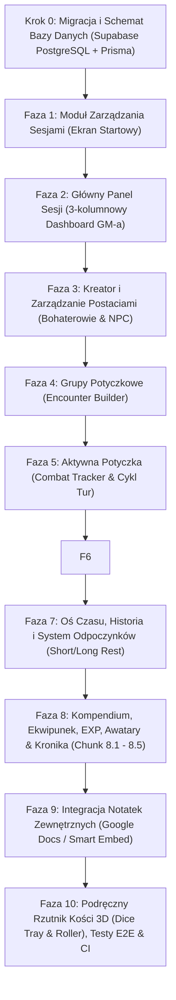

# Plan Implementacji Aplikacji Game Master Tracker (D&D 5e / TableOps)

> Dokument przygotowany na podstawie specyfikacji technicznej, schematu bazy danych oraz historyjek użytkownika zawartych w katalogu `user-stories-and-spec/`.  
> Wszystkie moduły są podzielone na małe, weryfikowalne kroki (chunki) z precyzyjnymi kryteriami testowymi.  
> **Standard wizualny:** Kontynuacja istniejącego, dopracowanego stylu dark-mode / glassmorphism (`#090d16`, akcenty `indigo`/`amber`, Tailwind CSS v4, biblioteka ikon `lucide-react`, panele `glass-card`).

---

## 🎨 Wytyczne Spójności Wizualnej (Design System)

Wszystkie nowe widoki i komponenty **muszą** ściśle bazować na dotychczas zaimplementowanym stylu w [`src/app/globals.css`](file:///Users/lukaszkosobucki/Documents/table-ops/src/app/globals.css) i [`src/components/MainDashboard.tsx`](file:///Users/lukaszkosobucki/Documents/table-ops/src/components/MainDashboard.tsx):

* **Tło i paleta bazowa:** Głęboka czerń/granat `#090d16` (background), `#0f172a` (karty i panele), obramowania `border-slate-800/80` lub `border-slate-700/60`.
* **Kolory wiodące (Akcenty):**
  * **Primary (Magia / System):** Indigo (`#6366f1` / `bg-gradient-to-r from-indigo-600 to-indigo-700`).
  * **Accent (Mistrz Gry / D&D / Ogień):** Amber/Gold (`#d97706` / `text-amber-400`).
  * **Wskaźniki stanu życia:**
    * Żywy / Zdolny do walki: szmaragdowa kropka `w-2.5 h-2.5 rounded-full bg-emerald-500 shadow-sm shadow-emerald-500/50`.
    * Nieprzytomny / Martwy (HP = 0): czerwony badge `text-rose-400 bg-rose-500/10 border border-rose-500/30` z ikoną czaszki (`Skull`).
* **Efekty szkła (Glassmorphism):**
  * `.glass-panel`: `bg-slate-900/75 backdrop-blur-md border border-white/5`.
  * `.glass-card`: `bg-slate-800/60 backdrop-blur-sm border border-white/5 hover:border-indigo-500/40 hover:shadow-indigo-500/10`.
* **Typografia i dane:** Bezszeryfowy tekst podstawowy (`font-sans`), dane mechaniczne (statystyki, rzuty kośćmi, modyfikatory, obrażenia, logi czasu) w kroju `font-mono`.
* **Responsywność:** 3-kolumnowy kokpit GM-a na dużych ekranach, który na mniejszych ekranach składa się w intuicyjne zakładki lub wysuwane panele boczne (Drawers).

---

## 🗺️ Mapa Drogowa Implementacji (Roadmap)

---

## KROK 0: Aktualizacja Schematu Bazy Danych (Supabase PostgreSQL + Prisma)

*Cel:* Zsynchronizowanie pliku [`prisma/schema.prisma`](file:///Users/lukaszkosobucki/Documents/table-ops/prisma/schema.prisma) ze specyfikacją [`user-stories-and-spec/schemat_bazy_danych.md`](file:///Users/lukaszkosobucki/Documents/table-ops/user-stories-and-spec/schemat_bazy_danych.md) oraz bazą Supabase (PostgreSQL). Głównym korzeniem logiki staje się encja `Session`.

### Chunk 0.1: Modele Sesji, Postaci i Potyczek w Prisma (✅ Zakończone)
* **Backend:**
  * Utworzenie modelu `Session` (`id`, `name`, `createdAt`, `updatedAt`).
  * Aktualizacja modelu `Character` (`sessionId`, `type` [HERO/NPC], `name`, `class`, `level`, `maxHp`, `currentHp`, `ac`, `stats` [JSON], `proficiencies` [JSON], `traits` [JSON], `inventory` [JSON], `spells` [JSON]).
  * Dodanie modeli grup potyczkowych: `EncounterGroup` (`id`, `sessionId`, `name`) oraz `EncounterMember` (`id`, `groupId`, `characterId?`, `apiMonsterId?`, `count`).
  * Dodanie modeli aktywnej walki: `Combat` (`id`, `sessionId`, `status` [PREPARING/ACTIVE/FINISHED], `currentRound`, `currentTurnIndex`, `createdAt`, `endedAt`), `Combatant` (`id`, `combatId`, `characterId?`, `apiMonsterId?`, `nameOverride`, `initiative`, `currentHp`, `maxHp`, `ac`, `order`), `CombatStatus` (`id`, `combatantId`, `statusName`, `durationTurns`).
  * Dodanie modelu historii: `SessionLog` (`id`, `sessionId`, `combatId?`, `logType` [REST_SHORT/REST_LONG/COMBAT_END/SPELL_CAST/COMBAT_ACTION], `description`, `metadata` [JSON], `createdAt`).
  * Zachowanie i powiązanie z istniejącym modelem `Monster`.
  * Dodanie indeksów na kluczach obcych (`@@index`) wg wytycznych wydajności Supabase PostgreSQL.
* **Weryfikacja / Testy:**
  * Wykonanie `npm run prisma:generate`.
  * Weryfikacja poprawności generowanych typów TypeScript w `node_modules/@prisma/client` oraz test w [`src/lib/prisma-schema.test.ts`](file:///Users/lukaszkosobucki/Documents/table-ops/src/lib/prisma-schema.test.ts).
  * Wykonanie pełnego suite testów Vitest, lintera Biome oraz Next.js build.

---

## FAZA 1: Moduł Zarządzania Sesjami (Ekran Startowy)
*User Stories:* [`user-stories-and-spec/user_stories_modu_sesji.md`](file:///Users/lukaszkosobucki/Documents/table-ops/user-stories-and-spec/user_stories_modu_sesji.md)  
*API Spec:* [`user-stories-and-spec/wymagania_crud_api.md`](file:///Users/lukaszkosobucki/Documents/table-ops/user-stories-and-spec/wymagania_crud_api.md) (Sekcja 1)

### Chunk 1.1: Backend – CRUD Sesji (✅ Zakończone)
* **Backend:**
  * Moduł domeny [`src/lib/sessions.ts`](file:///Users/lukaszkosobucki/Documents/table-ops/src/lib/sessions.ts) z walidacją nazwy (min. 2, max. 60 znaków), funkcjami `getSessions`, `createSession`, `updateSession`, `deleteSession` oraz wstrzykiwaniem klienta Prisma (DI).
  * Endpoint `GET /api/sessions`: zwraca listę sesji posortowaną po `updatedAt DESC` wraz z zagregowaną liczbą przypisanych postaci i logów (`_count: { characters, sessionLogs }`).
  * Endpoint `POST /api/sessions`: walidacja nazwy i utworzenie nowej sesji (HTTP 201).
  * Endpoint `PUT /api/sessions/[id]`: aktualizacja nazwy sesji z obsługą błędu 404 (HTTP 200).
  * Endpoint `DELETE /api/sessions/[id]`: usunięcie sesji z obsługą błędu 404 i kaskadowym usuwaniem powiązanych danych (HTTP 200).
* **Testowanie:**
  * Testy jednostkowe logiki i walidacji w [`src/lib/sessions.test.ts`](file:///Users/lukaszkosobucki/Documents/table-ops/src/lib/sessions.test.ts).
  * Testy integracyjne endpointów w [`src/app/api/sessions/sessions-api.test.ts`](file:///Users/lukaszkosobucki/Documents/table-ops/src/app/api/sessions/sessions-api.test.ts).

### Chunk 1.2: Frontend – Ekran Wyboru i Tworzenia Sesji (✅ Zakończone)
* **Frontend:**
  * Moduł widoku wyboru sesji [`src/components/sessions/SessionSelection.tsx`](file:///Users/lukaszkosobucki/Documents/table-ops/src/components/sessions/SessionSelection.tsx) z kafelkami istniejących kampanii, filtrowaniem po nazwie, datą aktualizacji, licznikami bohaterów i wpisów kroniki, akcjami przejścia, edycji oraz usunięcia.
  * Pusty stan (Empty State) zachęcający do stworzenia pierwszej sesji RPG.
  * Modal szybkiego tworzenia nowej sesji [`src/components/sessions/CreateSessionModal.tsx`](file:///Users/lukaszkosobucki/Documents/table-ops/src/components/sessions/CreateSessionModal.tsx) z automatycznym wyborem i przekierowaniem do kokpitu.
  * Modal edycji nazwy sesji [`src/components/sessions/EditSessionModal.tsx`](file:///Users/lukaszkosobucki/Documents/table-ops/src/components/sessions/EditSessionModal.tsx).
  * Przełącznik aktywnej sesji [`src/components/sessions/SessionSwitcher.tsx`](file:///Users/lukaszkosobucki/Documents/table-ops/src/components/sessions/SessionSwitcher.tsx) wbudowany w górny pasek nawigacji [`src/components/layout/Navbar.tsx`](file:///Users/lukaszkosobucki/Documents/table-ops/src/components/layout/Navbar.tsx).
  * Dynamiczne ładowanie widoku (`bundle-dynamic-imports`), zarządzanie stanem i obsługa localStorage w [`src/components/MainDashboard.tsx`](file:///Users/lukaszkosobucki/Documents/table-ops/src/components/MainDashboard.tsx).
  * Blokada dostępu na poziomie routingu (Access Guard): bez aktywnej sesji pozostałe moduły (Kokpit GM, Bestiariusz, Kreator, Kości) są zablokowane i oznaczone kłódkami w Navbarze, a próba wejścia z poziomu URL wymusza powrót do widoku sesji.
* **Testowanie:**
  * Testy komponentu w React Testing Library ([`src/components/sessions/SessionSelection.test.tsx`](file:///Users/lukaszkosobucki/Documents/table-ops/src/components/sessions/SessionSelection.test.tsx)): weryfikacja pustego stanu, renderowania kafelków, otwarcia modala i akcji tworzenia nowej sesji.

---

## FAZA 2: Główny Panel Sesji (3-kolumnowy Dashboard GM-a)
*User Stories:* [`user-stories-and-spec/user_stories_3_kolumnowy_kokpit_gm.md`](file:///Users/lukaszkosobucki/Documents/table-ops/user-stories-and-spec/user_stories_3_kolumnowy_kokpit_gm.md)  
*API Spec:* [`user-stories-and-spec/wymagania_crud_api.md`](file:///Users/lukaszkosobucki/Documents/table-ops/user-stories-and-spec/wymagania_crud_api.md) (Sekcja 7)

### Chunk 2.1: Backend – Full State Aggregator API (✅ Zakończone)
* **Backend:**
  * Endpoint `GET /api/sessions/[id]/full-state` zwracający w jednym zapytaniu:
    * Dane sesji (`session`).
    * Listę bohaterów i NPC (`characters`, posortowane po `createdAt ASC`).
    * Zdefiniowane grupy potyczkowe (`encounterGroups`) wraz z członkami (`members`) oraz powiązanymi danymi bestiariusza (`monster`) i bohaterów (`character`).
    * Aktywną walkę (`activeCombat`) ze statusem `PREPARING` lub `ACTIVE` wraz z uczestnikami (`combatants`, posortowane po `order ASC`) i ich statusami (`statuses`).
    * Ostatnie 20 wpisów z osi czasu sesji (`sessionLogs`, posortowane po `createdAt DESC`).
  * Funkcja domenowa `getSessionFullState` w [`src/lib/sessions.ts`](file:///Users/lukaszkosobucki/Documents/table-ops/src/lib/sessions.ts) z pojedynczym zapytaniem `prisma.session.findUnique({ include: { ... } })`.
  * Endpoint `GET /api/sessions/[id]/full-state` w [`src/app/api/sessions/[id]/full-state/route.ts`](file:///Users/lukaszkosobucki/Documents/table-ops/src/app/api/sessions/[id]/full-state/route.ts) z obsługą kodów 200, 400, 404 i 500.
* **Testowanie:**
  * Testy jednostkowe funkcji domenowej i struktury zapytań w [`src/lib/sessions.test.ts`](file:///Users/lukaszkosobucki/Documents/table-ops/src/lib/sessions.test.ts).
  * Testy integracyjne endpointu HTTP w [`src/app/api/sessions/[id]/full-state/full-state-api.test.ts`](file:///Users/lukaszkosobucki/Documents/table-ops/src/app/api/sessions/[id]/full-state/full-state-api.test.ts).
  * Test wydajnościowy zapytania w pamięci (< 100ms) oraz pomyślna weryfikacja bezpośredniego odpytania bazy PostgreSQL Supabase.

### Chunk 2.2: Frontend – Implementacja Układu 3-Kolumnowego (✅ Zakończone)
* **Frontend:**
  * Refaktoryzacja [`src/components/MainDashboard.tsx`](file:///Users/lukaszkosobucki/Documents/table-ops/src/components/MainDashboard.tsx) i implementacja orkiestratora [`src/components/dashboard/GmDashboard.tsx`](file:///Users/lukaszkosobucki/Documents/table-ops/src/components/dashboard/GmDashboard.tsx) z układem 3-kolumnowym (siatka 12-kolumnowa Tailwind):
    * **Lewa Kolumna ([`src/components/dashboard/PartySidebar.tsx`](file:///Users/lukaszkosobucki/Documents/table-ops/src/components/dashboard/PartySidebar.tsx)):** stała szerokość (~300px), kompaktowe karty postaci (Avatar/Inicjał, Pasek HP z dynamicznym kolorem, wskaźniki witalności: Healthy, Bloodied, Critical z pulsem, Dead z czaszką 0 HP, AC z tarczą, Pasywna Percepcja z okiem). Kliknięcie karty otwiera podgląd postaci w centrum.
    * **Środkowa Kolumna (Obszar Roboczy / Scena):** elastyczny kontener przełączany kontekstowo ([`src/components/dashboard/CharacterInspectionCard.tsx`](file:///Users/lukaszkosobucki/Documents/table-ops/src/components/dashboard/CharacterInspectionCard.tsx) do LARPowania i cech postaci, [`src/components/dashboard/LogInspectionCard.tsx`](file:///Users/lukaszkosobucki/Documents/table-ops/src/components/dashboard/LogInspectionCard.tsx) do szczegółów wpisów, oraz domyślny Tracker Inicjatywy [`src/components/initiative/InitiativeTracker.tsx`](file:///Users/lukaszkosobucki/Documents/table-ops/src/components/initiative/InitiativeTracker.tsx)).
    * **Prawa Kolumna ([`src/components/dashboard/TimelineSidebar.tsx`](file:///Users/lukaszkosobucki/Documents/table-ops/src/components/dashboard/TimelineSidebar.tsx)):** chronologiczna oś czasu sesji z odznaczeniami typów zdarzeń, podręczny moduł rzutów kośćmi (d4, d6, d8, d10, d12, d20, d100) z natychmiastowym wynikiem oraz podręczne notatki GM-a.
  * Zapewnienie pełnej responsywności: na ekranach mobilnych i tabletach (< lg) kolumny są składane do przełącznika zakładek (`[Drużyna]`, `[Scena Walki]`, `[Oś Czasu]`).
* **Testowanie:**
  * Testy jednostkowe w React Testing Library dla [`src/components/dashboard/PartySidebar.test.tsx`](file:///Users/lukaszkosobucki/Documents/table-ops/src/components/dashboard/PartySidebar.test.tsx) oraz [`src/components/dashboard/GmDashboard.test.tsx`](file:///Users/lukaszkosobucki/Documents/table-ops/src/components/dashboard/GmDashboard.test.tsx) (84/84 testy zielone).
  * Testy E2E Playwright ([`e2e/dashboard-3col.spec.ts`](file:///Users/lukaszkosobucki/Documents/table-ops/e2e/dashboard-3col.spec.ts)): weryfikacja renderowania 3 kolumn na rozdzielczości Desktop (1920x1080), interaktywnej inspekcji oraz poprawnego działania przełącznika mobilnego na widoku (375x667). Wszystkie 9 testów E2E zielone.

---

## FAZA 3: Kreator i Zarządzanie Postaciami (Bohaterowie i NPC)
*User Stories:* [`user-stories-and-spec/user_stories_kreator_i_karty_postaci.md`](file:///Users/lukaszkosobucki/Documents/table-ops/user-stories-and-spec/user_stories_kreator_i_karty_postaci.md)  
*API Spec:* [`user-stories-and-spec/wymagania_crud_api.md`](file:///Users/lukaszkosobucki/Documents/table-ops/user-stories-and-spec/wymagania_crud_api.md) (Sekcja 2)

### Chunk 3.1: Backend – Obsługa Postaci i Reguł SRD ✅
* **Status:** Zrealizowany i przetestowany.
* **Backend:**
  * Domena [`src/lib/characters.ts`](file:///Users/lukaszkosobucki/Documents/table-ops/src/lib/characters.ts): walidacja, kalkulacje D&D 5e, CRUD i mutacje HP/slotów.
  * Reguły D&D 5e [`src/lib/dnd-rules.ts`](file:///Users/lukaszkosobucki/Documents/table-ops/src/lib/dnd-rules.ts): kalkulator kości życia `getClassHitDie` (d12, d10, d8, d6), pełna macierz slotów czarów 1-20 `calculateSpellSlots` (Full Caster, Half Caster, Warlock Pact Magic), mechanika absorpcji obrażeń przez punkty tymczasowe `applyDamage`, leczenie `applyHealing`, reguła niestakowania `tempHp` `applyTempHp` oraz zarządzanie komórkami czarów `modifySpellSlot`.
  * `POST /api/characters`: tworzenie i walidacja postaci przypisanej do sesji.
  * `GET /api/characters/[id]`, `PUT /api/characters/[id]`, `DELETE /api/characters/[id]`: pełny CRUD pojedynczej postaci.
  * `PATCH /api/characters/[id]/hp`: szybka mutacja HP (obrażenia, leczenie, punkty tymczasowe, format delta).
  * `PATCH /api/characters/[id]/slots`: używanie, odzyskiwanie i ustawianie slotów czarów.
  * `GET /api/sessions/[id]/characters`, `POST /api/sessions/[id]/characters`: operacje na postaciach w kontekście sesji.
* **Testowanie:**
  * [`src/lib/dnd-rules.test.ts`](file:///Users/lukaszkosobucki/Documents/table-ops/src/lib/dnd-rules.test.ts) (19 testów jednostkowych reguł SRD).
  * [`src/lib/characters.test.ts`](file:///Users/lukaszkosobucki/Documents/table-ops/src/lib/characters.test.ts) (21 testów jednostkowych serwisu postaci).
  * [`src/app/api/characters/characters-api.test.ts`](file:///Users/lukaszkosobucki/Documents/table-ops/src/app/api/characters/characters-api.test.ts) (15 testów integracyjnych endpointów REST).

### Chunk 3.2: Frontend – Kreator Postaci (Krok po Kroku) & Szybka Karta (✅ Zakończone)
* **Frontend ([`src/components/characters/`](file:///Users/lukaszkosobucki/Documents/table-ops/src/components/characters/)):**
  * Wielokrokowy wizard tworzenia bohatera i NPC:
    * Krok 1: Tożsamość (Imię, Rasa, Klasa, Poziom, Typ: Bohater/NPC, wskazówki odgrywania LARP dla MG).
    * Krok 2: Statystyki (Standard Array: 15, 14, 13, 12, 10, 8 lub rzut kośćmi 4d6 drop lowest via `roll4d6DropLowest`).
    * Krok 3: Pancerz i Życie (automatyczna kalkulacja bazowego HP wg kości k6/k8/k10/k12 + MOD Kondycji, pasywna percepcja 10 + WIS mod, unarmored AC).
    * Krok 4: Podsumowanie & Magia (podgląd slotów czarów wg tabeli czarowników D&D 5e dla klas rzucających czary, zapis asynchroniczny `POST /api/characters`).
  * Rozbudowana Karta Postaci w Środkowej Kolumnie ([`src/components/dashboard/CharacterInspectionCard.tsx`](file:///Users/lukaszkosobucki/Documents/table-ops/src/components/dashboard/CharacterInspectionCard.tsx)):
    * Interaktywne zarządzanie HP (szybkie przyciski `-1`, `-5`, `-10`, `+1`, `+5`, `+10`, absorpcja przez punkty tymczasowe `tempHp`, dedykowany modal z akcjami obrażeń/leczenia/punktów tymczasowych, mutacje `PATCH /api/characters/[id]/hp`).
    * Klikalne sloty czarów z podglądem zużycia (kropki `●` wolny / `○` zużyty) z bezpośrednią synchronizacją przez `PATCH /api/characters/[id]/slots`.
    * Interaktywne testy atrybutów i rzuty obronne d20 + modyfikator z animowanym bannerem wyników rzutu.
    * Dwukierunkowa synchronizacja stanu z `GmDashboard.tsx` (`onCharacterUpdate`).
* **Testowanie:**
  * Testy komponentów w Vitest / React Testing Library:
    * [`src/components/characters/CharacterWizard.test.tsx`](file:///Users/lukaszkosobucki/Documents/table-ops/src/components/characters/CharacterWizard.test.tsx) – test nawigacji krok po kroku kreatora, generowania Standard Array, przeliczeń D&D, podglądu slotów magii oraz zapisu przez API.
    * [`src/components/dashboard/CharacterInspectionCard.test.tsx`](file:///Users/lukaszkosobucki/Documents/table-ops/src/components/dashboard/CharacterInspectionCard.test.tsx) – test interaktywnego zarządzania HP, klikania slotów czarów, rzutów d20 na atrybuty i rzuty obronne.
  * Wszystkie testy jednostkowe (139/139), lint Biome (107 plików, 0 błędów), build Turbopack oraz E2E Playwright (9/9) zakończone sukcesem.

---

## FAZA 4: Zarządzanie Grupami Potyczkowymi (Encounter Builder)
*User Stories:* [`user-stories-and-spec/user_stories_zarzadzanie_potyczkami.md`](file:///Users/lukaszkosobucki/Documents/table-ops/user-stories-and-spec/user_stories_zarzadzanie_potyczkami.md)  
*API Spec:* [`user-stories-and-spec/wymagania_crud_api.md`](file:///Users/lukaszkosobucki/Documents/table-ops/user-stories-and-spec/wymagania_crud_api.md) (Sekcja 3)

### Chunk 4.1: Backend – Modelowanie i Zapis Grup Potyczkowych (✅ Zakończone)
* **Backend:**
  * Domena [`src/lib/encounters.ts`](file:///Users/lukaszkosobucki/Documents/table-ops/src/lib/encounters.ts): walidacja danych wejściowych `validateEncounterInput`, operacje pobierania `getEncountersBySession` i `getEncounterById`, tworzenie grup potyczkowych `createEncounter`, atomowa wymiana członków grupy w transakcji `updateEncounter` oraz usuwanie `deleteEncounter`.
  * Reguły D&D 5e w [`src/lib/dnd-rules.ts`](file:///Users/lukaszkosobucki/Documents/table-ops/src/lib/dnd-rules.ts):
    * Progi doświadczenia drużyny DMG `calculatePartyXpThresholds` (Easy, Medium, Hard, Deadly dla poziomów 1-20).
    * Mnożnik spotkania DMG `getEncounterMultiplier` uwzględniający liczbę potworów oraz korektę na wielkość drużyny (< 3 bohaterów lub >= 6 bohaterów).
    * Kompleksowy ewaluator trudności `calculateEncounterDifficulty` zwracający sumaryczne XP, skorygowane XP, mnożnik, progi punktowe i wyliczony poziom trudności (`trivial`, `easy`, `medium`, `hard`, `deadly`).
  * Endpoint `GET /api/sessions/[id]/encounters`: lista grup potyczkowych dla danej sesji ze złączonymi relacjami potworów i bohaterów.
  * Endpoint `POST /api/sessions/[id]/encounters`: tworzenie nowej grupy potyczkowej w kontekście sesji.
  * Endpoint `POST /api/encounters`: top-level endpoint tworzenia grupy potyczkowej.
  * Endpoint `GET /api/encounters/[id]`: szczegóły pojedynczej grupy potyczkowej wraz z członkami.
  * Endpoint `PUT /api/encounters/[id]`: atomowa aktualizacja nazwy oraz wymiana członków potyczki w transakcji `$transaction`.
  * Endpoint `DELETE /api/encounters/[id]`: usunięcie grupy potyczkowej (kaskadowe usunięcie członków w Prisma).
* **Testowanie:**
  * [`src/lib/dnd-rules.test.ts`](file:///Users/lukaszkosobucki/Documents/table-ops/src/lib/dnd-rules.test.ts): 31 testów reguł D&D (w tym testy progów XP i kalkulatora trudności potyczek).
  * [`src/lib/encounters.test.ts`](file:///Users/lukaszkosobucki/Documents/table-ops/src/lib/encounters.test.ts): 14 testów jednostkowych logiki domenowej, walidacji i atomowych transakcji.
  * [`src/app/api/encounters/encounters-api.test.ts`](file:///Users/lukaszkosobucki/Documents/table-ops/src/app/api/encounters/encounters-api.test.ts): 10 testów integracyjnych endpointów REST.
  * Wszystkie 176 testów jednostkowych Vitest, 0 błędów Biome linter, czysty build Next.js/Turbopack oraz 9/9 testów E2E Playwright zielone.

### Chunk 4.2: Frontend – Kreator Potyczek (Encounter Builder UI) (✅ Zakończone)
* **Frontend:**
  * Komponent [`src/components/encounters/EncounterBuilder.tsx`](file:///Users/lukaszkosobucki/Documents/table-ops/src/components/encounters/EncounterBuilder.tsx) zintegrowany ze Środkową Kolumną [`src/components/dashboard/GmDashboard.tsx`](file:///Users/lukaszkosobucki/Documents/table-ops/src/components/dashboard/GmDashboard.tsx):
    * **Lista Zapisanych Zestawów:** przegląd zestawów potyczek dla sesji z podglądem składu grupy, łącznego bazowego XP, mnożnika oraz dynamicznego odznaczenia trudności (`DifficultyBadge`).
    * **Szybki Start Walki:** przycisk *"Załaduj do Inicjatywy"*, który automatycznie przekształca potwory z grupy w ponumerowanych uczestników walki (np. *Goblin #1*, *Goblin #2*), losuje dla nich rzuty na inicjatywę z modyfikatorem Zręczności (D20 + DEX mod), dopisuje do kolejki i przełącza widok do walki.
    * **Edytor i Wyszukiwarka Bestiariusza:** tworzenie i edycja zestawów, filtrowanie potworów po nazwie oraz klasie pancerza / CR (wszystkie, 0–1, 2–4, 5+), stepper liczebności potworów.
    * **Kalkulator Trudności DMG na Żywo:** interaktywny licznik trudności potyczki (*Trywialna*, *Łatwa*, *Średnia*, *Trudna*, *Śmiertelna*) obliczany na żywo na podstawie sumy XP przeciwników, mnożnika liczebności potworów i progów doświadczenia aktywnej drużyny graczy.
    * Zapis asynchroniczny (`POST /api/sessions/[id]/encounters` i `PUT /api/encounters/[id]`) oraz opcja natychmiastowego zapisu i przejścia do walki (*"Zapisz i Załaduj do Walki"*).
* **Testowanie:**
  * [`src/components/encounters/EncounterBuilder.test.tsx`](file:///Users/lukaszkosobucki/Documents/table-ops/src/components/encounters/EncounterBuilder.test.tsx): testy RTL renderowania podsumowania drużyny, ładowania zapisanych potyczek, kalkulacji trudności na żywo i zapisu potyczki.
  * [`src/components/dashboard/GmDashboard.test.tsx`](file:///Users/lukaszkosobucki/Documents/table-ops/src/components/dashboard/GmDashboard.test.tsx): test przełączania widoku środkowej kolumny do Encounter Buildera i powrotu do trackera walki.
  * [`e2e/initiative.spec.ts`](file:///Users/lukaszkosobucki/Documents/table-ops/e2e/initiative.spec.ts): test E2E Playwright weryfikujący nawigację do kreatora potyczek i powrót na żywej aplikacji.
  * Wszystkie 183 testy jednostkowe Vitest (100% zielone), 0 błędów Biome, build Turbopack oraz 10/10 testów Playwright E2E zielone.

---

## FAZA 5: Aktywna Potyczka (Combat Tracker & Cykl Tur)
*User Stories:* [`user-stories-and-spec/user_stories_aktywna_walka_i_tracker_tur.md`](file:///Users/lukaszkosobucki/Documents/table-ops/user-stories-and-spec/user_stories_aktywna_walka_i_tracker_tur.md)  
*API Spec:* [`user-stories-and-spec/wymagania_crud_api.md`](file:///Users/lukaszkosobucki/Documents/table-ops/user-stories-and-spec/wymagania_crud_api.md) (Sekcja 4)

### Chunk 5.1: Backend – Maszyna Stanu Walki i Endpointy Akcji (✅ Zakończone)
* **Backend:**
  * Domena [`src/lib/combat.ts`](file:///Users/lukaszkosobucki/Documents/table-ops/src/lib/combat.ts):
    * `startCombat`: utworzenie instancji walki, walidacja sesji, posortowanie uczestników wg inicjatywy (`initiative DESC`), przypisanie kolejności (`order: 0, 1, 2...`) i utworzenie wpisu w logach sesji.
    * `nextTurn`: maszyna cyklu tur – inkrementacja `currentTurnIndex`, przejście do nowej rundy (`currentRound + 1`) przy końcu kolejki, automatyczne dekrementowanie czasu trwania aktywnych statusów (`durationTurns - 1`) i usuwanie wygasłych (`durationTurns <= 0`), generowanie wpisu w historii sesji (`COMBAT_ACTION`).
    * `addCombatantToCombat`: dynamiczne dodanie uczestnika w trakcie walki (posiłki).
    * `applyStatusToCombatant` i `removeStatusFromCombatant`: nakładanie statusów czasowych z czasem trwania w turach oraz ich usuwanie.
    * `updateCombatantHp`: modyfikacja HP uczestnika z ograniczeniem do przedziału `0` do `maxHp`.
    * `endCombat`: zakończenie walki (`status: FINISHED`, `endedAt`), automatyczna synchronizacja odniesionych obrażeń bohaterów graczy do głównej tabeli `characters` i utworzenie wpisu `COMBAT_END`.
  * REST Route Handlers:
    * `POST /api/combat/start`: rozpoczęcie nowej walki.
    * `GET /api/combat/[id]`: pobranie stanu walki ze złączonymi uczestnikami, statusami, potworami i postaciami.
    * `POST /api/combat/[id]/next-turn`: przejście do kolejnej tury.
    * `POST /api/combat/[id]/combatants`: dodanie uczestnika do walki.
    * `PATCH /api/combat/[id]/combatants/[combatantId]`: aktualizacja HP uczestnika.
    * `POST /api/combat/[id]/combatants/[combatantId]/status`: nałożenie statusu.
    * `DELETE /api/combat/[id]/combatants/[combatantId]/status/[statusId]`: usunięcie statusu.
    * `POST /api/combat/[id]/end`: zakończenie walki i synchronizacja postaci.
* **Testowanie:**
  * [`src/lib/combat.test.ts`](file:///Users/lukaszkosobucki/Documents/table-ops/src/lib/combat.test.ts): 11 testów jednostkowych maszyny stanu walki, cyklu tur, wygasania statusów, dynamicznych posiłków i synchronizacji HP.
  * [`src/app/api/combat/combat-api.test.ts`](file:///Users/lukaszkosobucki/Documents/table-ops/src/app/api/combat/combat-api.test.ts): 10 testów integracyjnych endpointów REST.
  * Wszystkie 204 testy jednostkowe Vitest (100% zielone), 0 błędów Biome, czysty build Turbopack oraz 10/10 testów Playwright E2E zielone.

### Chunk 5.2: Frontend – Interfejs Śledzenia Walki (Combat View) (✅ Zakończone)
* **Frontend ([`src/components/initiative/`](file:///Users/lukaszkosobucki/Documents/table-ops/src/components/initiative/)):**
  * Ewolucja modułu inicjatywy w pełny system walki z maszynami 3 faz:
  * **Krok 1 (Faza PREPARING):**
    * Wybór grupy potyczkowej lub ręczne dodanie potworów i bohaterów (`AddCombatantsPanel`).
    * Przycisk *"Losuj Inicjatywę Potworów"* (D20 + DEX mod) oraz pola do wpisania ręcznego dla każdego uczestnika (gdy gracze rzucają fizycznymi kośćmi przy stole).
    * Wyróżniony przycisk **"⚔️ Rozpocznij Walkę"** (`data-testid="start-combat-btn"`), który sortuje kolejkę, zamraża edycję i rozpoczyna cykl tur (wraz z opcjonalną synchronizacją `POST /api/combat/start`).
  * **Krok 2 (Faza ACTIVE):**
    * Wyraźny wskaźnik aktywnej tury: złote świecące obramowanie karty, boczny znacznik oraz pulsujący badge `⚔️ TERAZ TURA`, informacja w nagłówku *"Kto teraz"* i *"Kto następny"*.
    * Przycisk **"Następna Tura ➔"** (`data-testid="next-turn-btn"`) i licznik rund (*"Runda 1"*, *"Runda 2"...*).
    * Przy przejściu tury automatyczne dekrementowanie czasu trwania aktywnych statusów (`durationTurns - 1`) i usuwanie wygasłych (`durationTurns <= 0`).
    * Szybkie kontrolki HP: przyciski obrażeń (`-1`, `-5`, `-10`), leczenia (`+1`, `+5`, `+10`) oraz dedykowany input wartości własnych (*Obrażenia* / *Leczenie*).
    * Zarządzanie statusami: modal/popover nakładania statusów D&D 5e z precyzyjnym czasem trwania (1, 2, 3, 5 tur), bąbelki statusów z licznikiem pozostałych tur obok punktów życia i przyciskiem natychmiastowego zdjęcia.
    * Widget **"Kronika Walki"** ([`CombatLogWidget.tsx`](file:///Users/lukaszkosobucki/Documents/table-ops/src/components/initiative/CombatLogWidget.tsx)) na bieżąco rejestrujący zdarzenia tur, obrażenia, leczenie i zmiany statusów.
    * **Ładowanie Drużyny i Postaci do Walki (Hurtowo i Pojedynczo):**
      * Przycisk *"Załaduj Drużynę do Walki"* w nagłówku panelu postaci ([`PartySidebar.tsx`](file:///Users/lukaszkosobucki/Documents/table-ops/src/components/dashboard/PartySidebar.tsx)) oraz w pustym stanie trackera walki ([`InitiativeTracker.tsx`](file:///Users/lukaszkosobucki/Documents/table-ops/src/components/initiative/InitiativeTracker.tsx)) z dynamicznym licznikiem liczebności drużyny.
      * Przyciski *"Do walki"* na pojedynczych kartach bohaterów i NPC w lewej kolumnie oraz *"Dodaj do Walki"* w karcie inspekcji postaci ([`CharacterInspectionCard.tsx`](file:///Users/lukaszkosobucki/Documents/table-ops/src/components/dashboard/CharacterInspectionCard.tsx)).
      * Zabezpieczenie przed duplikowaniem uczestników oraz etykiety i odznaki stanu *"W walce"*.
      * Pełna synchronizacja: postacie zachowują powiązanie `characterId`, a przy aktywnej potyczce są rejestrowane przez API (`POST /api/combat/[id]/combatants`), a po zakończeniu walki (`endCombat`) ich punkty życia są trwale zapisywane w PostgreSQL.
  * **Krok 3 (Faza FINISHED):**
    * Przycisk **"Zakończ Walkę"** (`data-testid="end-combat-btn"`), estetyczny baner podsumowania walki z liczbą rund oraz opcja rozpoczęcia nowego starcia (*"Nowe Starcie"*).
    * Automatyczna synchronizacja aktualnego stanu HP bohaterów do lewej kolumny kokpitu GM-a (`onCombatEnd`).
* **Testowanie:**
  * [`src/lib/combat.test.ts`](file:///Users/lukaszkosobucki/Documents/table-ops/src/lib/combat.test.ts): 12 testów jednostkowych (w tym test autorytatywnej synchronizacji `heroUpdates` przy zakończeniu walki).
  * [`src/components/initiative/CombatantCard.test.tsx`](file:///Users/lukaszkosobucki/Documents/table-ops/src/components/initiative/CombatantCard.test.tsx): 7 testów jednostkowych (renderowanie, aktywny badge `TERAZ TURA`, przyciski szybkiego HP, obrażenia i leczenie z inputa, wybór czasu trwania statusu, usuwanie statusu i edycja inicjatywy w fazie PREPARING).
  * [`src/components/initiative/InitiativeTracker.test.tsx`](file:///Users/lukaszkosobucki/Documents/table-ops/src/components/initiative/InitiativeTracker.test.tsx): 8 testów jednostkowych (cykl tur, inkrementacja rund, dekrementacja i wygasanie statusów, przejścia faz, synchronizacja HP, brak duplikatów wpisów w kronice walki, przycisk ładowania drużyny).
  * [`src/components/initiative/TurnControls.test.tsx`](file:///Users/lukaszkosobucki/Documents/table-ops/src/components/initiative/TurnControls.test.tsx): 3 testy jednostkowe kontrolek tur.
  * [`src/components/dashboard/PartySidebar.test.tsx`](file:///Users/lukaszkosobucki/Documents/table-ops/src/components/dashboard/PartySidebar.test.tsx): 7 testów jednostkowych (renderowanie drużyny/NPC, przycisk ładowania drużyny, dodawanie pojedynczych postaci, odznaki "W walce").
  * [`src/components/dashboard/CharacterInspectionCard.test.tsx`](file:///Users/lukaszkosobucki/Documents/table-ops/src/components/dashboard/CharacterInspectionCard.test.tsx): 7 testów jednostkowych (zarządzanie HP, sloty czarów, rzuty d20 oraz dodawanie do walki z inspekcji).
  * [`src/components/dashboard/GmDashboard.test.tsx`](file:///Users/lukaszkosobucki/Documents/table-ops/src/components/dashboard/GmDashboard.test.tsx): 7 testów integracyjnych (layout 3 kolumn, orkiestracja walki, hurtowe dodawanie drużyny, dodawanie postaci, synchronizacja).
  * [`e2e/initiative.spec.ts`](file:///Users/lukaszkosobucki/Documents/table-ops/e2e/initiative.spec.ts): 7 testów E2E Playwright sprawdzających pełny cykl życia walki na żywej aplikacji, ładowanie drużyny i pojedynczych postaci/NPC, szybkie klikanie obrażeń z natychmiastowym zakończeniem walki (debounced & authoritative sync), trwałość stanu (rundy, tury, HP, statusy) w bazie PostgreSQL po odświeżeniu strony (F5) oraz prawidłowe zamknięcie i powrót do fazy PREPARING po zakończeniu walki.
  * Pełna integracja trwałości cyklu życia potyczki:
    * Sesja bez aktywnej potyczki startuje w fazie `PREPARING` z widocznym przyciskiem *"Rozpocznij Walkę"*.
    * Kliknięcie *"Rozpocznij Walkę"* tworzy rekord w PostgreSQL (`POST /api/combat/start`), pobiera UUID-y uczestników i przechodzi do fazy `ACTIVE`.
    * Kolejne akcje (przejścia tur `next-turn`, zmiany HP z debouncingiem 500ms i wartościami bezwzględnymi `PATCH`, statusy, posiłki) są trwale i bezpiecznie zapisywane w PostgreSQL bez zalewania bazy i bez race conditions.
    * Odświeżenie strony (F5) odtwarza dokładny stan potyczki, rundę i tury bez utraty danych.
    * Kliknięcie *"Zakończ Walkę"* zamyka walkę w PostgreSQL (`status: FINISHED`), autorytatywnie przekazuje finalny stan HP bohaterów (`heroUpdates`), synchronizuje punkty życia postaci w PostgreSQL i przywraca stan przygotowania.
  * Wszystkie 227 testów jednostkowych Vitest (100% zielone, 27 plików), 0 błędów Biome linter (135 plików), czysty build Turbopack oraz 14/14 testów Playwright E2E zielone (100%).

---

## FAZA 6: Autentykacja i Konta Użytkowników (Supabase Auth & Multi-Tenancy)
*User Stories:* [`user-stories-and-spec/user_stories_autentykacja_i_konta.md`](file:///Users/lukaszkosobucki/Documents/table-ops/user-stories-and-spec/user_stories_autentykacja_i_konta.md)  
*API Spec:* Supabase Auth / Next.js Server Actions & Route Handlers

### Chunk 6.1: Backend & Schema – Integracja Supabase Auth i Izolacja Danych Sesji (✅ Zakończone)
* **Backend & Baza Danych:**
  * Rozszerzenie modelu Prisma `Session` o pole `userId String? @map("user_id")` z indeksem `@@index([userId])` w [`prisma/schema.prisma`](file:///Users/lukaszkosobucki/Documents/table-ops/prisma/schema.prisma) i synchronizacja schematu (`prisma db push`).
  * Moduł autoryzacji [`src/lib/auth.ts`](file:///Users/lukaszkosobucki/Documents/table-ops/src/lib/auth.ts):
    * `getUserFromRequest`: weryfikuje tożsamość użytkownika z nagłówka `Authorization: Bearer <jwt>` lub ciasteczek Supabase SSR (`createClient()`).
    * `getGuestIdFromRequest`: pobiera unikalny token urządzenia gościa z nagłówka `x-guest-id` lub ciasteczka `tableops_guest_id`.
    * `getUserIdFromRequest`: priorytetyzuje zalogowane `user.id`, a dla gości zwraca unikalny `guestId` (pełna izolacja gości).
  * Proxy Next.js 16 [`src/proxy.ts`](file:///Users/lukaszkosobucki/Documents/table-ops/src/proxy.ts): odświeża tokeny Supabase w locie oraz automatycznie generuje i utrwala ciasteczko `tableops_guest_id` (`SameSite: Lax`, ważność 1 rok) dla każdego nowego odwiedzającego.
  * Klient pomocniczy [`src/lib/guest.ts`](file:///Users/lukaszkosobucki/Documents/table-ops/src/lib/guest.ts): dwukierunkowa synchronizacja tokena gościa między `document.cookie` a `localStorage`.
  * Serwis sesji [`src/lib/sessions.ts`](file:///Users/lukaszkosobucki/Documents/table-ops/src/lib/sessions.ts) z pełnym wsparciem wielodostępności i Opcji A:
    * `getSessions`: filtruje sesje ściśle według `userId` zalogowanego użytkownika lub `guestId` urządzenia gościa.
    * `createSession`, `updateSession`, `deleteSession`, `getSessionFullState`: zabezpieczenia przed nieautoryzowanym dostępem.
    * `claimGuestSessions`: atomowa migracja sesji gościa z urządzenia na konto zalogowanego użytkownika (`updateMany: userId = targetUserId WHERE userId = guestId`).
  * Route Handlery API:
    * [`src/app/api/sessions/route.ts`](file:///Users/lukaszkosobucki/Documents/table-ops/src/app/api/sessions/route.ts) – automatyczne przejmowanie (claim) sesji gościa po zalogowaniu oraz filtrowanie per użytkownik/gość.
    * [`src/app/api/sessions/claim/route.ts`](file:///Users/lukaszkosobucki/Documents/table-ops/src/app/api/sessions/claim/route.ts) – dedykowany endpoint do migracji sesji gościa.
    * [`src/app/api/sessions/[id]/route.ts`](file:///Users/lukaszkosobucki/Documents/table-ops/src/app/api/sessions/[id]/route.ts)
    * [`src/app/api/sessions/[id]/full-state/route.ts`](file:///Users/lukaszkosobucki/Documents/table-ops/src/app/api/sessions/[id]/full-state/route.ts)
* **Testowanie:**
  * [`src/lib/auth.test.ts`](file:///Users/lukaszkosobucki/Documents/table-ops/src/lib/auth.test.ts): 8 testów jednostkowych (ekstrakcja z tokena, ciasteczek, nagłówków `x-guest-id`, ciasteczek gościa i priorytetów).
  * [`src/lib/guest.test.ts`](file:///Users/lukaszkosobucki/Documents/table-ops/src/lib/guest.test.ts): 3 testy jednostkowe synchronizacji tokena gościa.
  * [`src/lib/sessions.test.ts`](file:///Users/lukaszkosobucki/Documents/table-ops/src/lib/sessions.test.ts): 24 testy jednostkowe (w tym 6 testów multi-tenancy oraz 3 testy migracji `claimGuestSessions`).
  * [`src/app/api/sessions/sessions-api.test.ts`](file:///Users/lukaszkosobucki/Documents/table-ops/src/app/api/sessions/sessions-api.test.ts): 14 testów integracyjnych endpointów REST.
  * [`src/app/api/sessions/sessions-isolation.test.ts`](file:///Users/lukaszkosobucki/Documents/table-ops/src/app/api/sessions/sessions-isolation.test.ts): testy pełnej izolacji między kontami oraz test izolacji i migracji urządzeń gości (Opcja A).

### Chunk 6.2: Frontend – Logowanie, Rejestracja i Google OAuth (✅ Zakończone)
* **Frontend ([`src/components/auth/`](file:///Users/lukaszkosobucki/Documents/table-ops/src/components/auth/)):**
  * Hook [`src/components/auth/useAuth.ts`](file:///Users/lukaszkosobucki/Documents/table-ops/src/components/auth/useAuth.ts): zarządzanie stanem sesji przez Supabase, logowanie hasłem, rejestracja, logowanie Google OAuth i wylogowanie.
  * Formularze [`LoginForm.tsx`](file:///Users/lukaszkosobucki/Documents/table-ops/src/components/auth/LoginForm.tsx) i [`RegisterForm.tsx`](file:///Users/lukaszkosobucki/Documents/table-ops/src/components/auth/RegisterForm.tsx):
    * Płynne przekierowanie po rejestracji do ekranu logowania (`/login?registered=true`) wraz z zielonym banerem potwierdzenia.
    * Walidacja haseł, logowanie Google OAuth, bezpieczny powrót do trybu gościa.
  * Strony uwierzytelniania w Next.js App Router:
    * [`src/app/login/page.tsx`](file:///Users/lukaszkosobucki/Documents/table-ops/src/app/login/page.tsx)
    * [`src/app/register/page.tsx`](file:///Users/lukaszkosobucki/Documents/table-ops/src/app/register/page.tsx)
    * [`src/app/auth/callback/route.ts`](file:///Users/lukaszkosobucki/Documents/table-ops/src/app/auth/callback/route.ts)
  * Pasek nawigacyjny [`src/components/layout/Navbar.tsx`](file:///Users/lukaszkosobucki/Documents/table-ops/src/components/layout/Navbar.tsx): profil użytkownika z awatarem i wylogowaniem lub przycisk logowania.
  * Dashboard [`src/components/MainDashboard.tsx`](file:///Users/lukaszkosobucki/Documents/table-ops/src/components/MainDashboard.tsx): przekazywanie tokena gościa w nagłówkach i cookies, eliminacja konfliktów URL.
* **Testowanie:**
  * [`src/components/auth/AuthForms.test.tsx`](file:///Users/lukaszkosobucki/Documents/table-ops/src/components/auth/AuthForms.test.tsx): 9 testów jednostkowych (w tym test przekierowania do `/login?registered=true` i baneru powitalnego).
  * [`src/components/layout/Navbar.test.tsx`](file:///Users/lukaszkosobucki/Documents/table-ops/src/components/layout/Navbar.test.tsx): 4 testy jednostkowe.
  * [`e2e/auth.spec.ts`](file:///Users/lukaszkosobucki/Documents/table-ops/e2e/auth.spec.ts): 2 testy E2E Playwright sprawdzające pełny flow nawigacji logowania/rejestracji oraz rzeczywistą izolację między osobnymi kontekstami przeglądarki gości (Option A).
  * Wszystkie 264 testy jednostkowe Vitest (31 plików, 100% zielone), 0 błędów Biome linter (150 plików), czysty build Turbopack oraz 16/16 testów Playwright E2E zielone (100%).

---

## FAZA 7: Oś Czasu, Historia i System Odpoczynków
*User Stories:* [`user-stories-and-spec/user_stories_modu_historii.md`](file:///Users/lukaszkosobucki/Documents/table-ops/user-stories-and-spec/user_stories_modu_historii.md)  
*API Spec:* [`user-stories-and-spec/wymagania_crud_api.md`](file:///Users/lukaszkosobucki/Documents/table-ops/user-stories-and-spec/wymagania_crud_api.md) (Sekcja 5)

### Chunk 7.1: Backend – Obsługa Logów i Automatyka Odpoczynków (✅ Zakończone)
* **Backend:**
  * Domena [`src/lib/logs.ts`](file:///Users/lukaszkosobucki/Documents/table-ops/src/lib/logs.ts):
    * `getSessionLogs`: pobieranie chronologicznej listy zdarzeń sesji z opcjonalnym filtrowaniem po typie (`REST_SHORT`, `REST_LONG`, `SPELL_CAST`, `COMBAT_ACTION`, `CUSTOM_NOTE`).
    * `createSessionLog`: dodanie zdarzenia z autoryzacją użytkownika/gościa i automatyką D&D 5e:
      * Typ `REST_LONG`: pełna automatyczna regeneracja tabeli `characters` dla wszystkich bohaterów sesji (`currentHp = maxHp`, zerowanie `tempHp = 0`, resetowanie zużytych slotów czarów `used: 0`), wygenerowanie podsumowującego wpisu na osi czasu.
      * Typ `REST_SHORT`: regeneracja HP bohaterów (z ograniczeniem do `maxHp`) i opcjonalne wydanie Kości Wytrzymałości (Hit Dice).
      * Typ `CUSTOM_NOTE` / `SPELL_CAST` / `COMBAT_ACTION`: rejestracja notatek narracyjnych i akcji fabularnych.
    * `getCombatLogs`: pobranie szczegółowej historii akcji z zakończonej lub aktywnej potyczki.
  * REST Route Handlers:
    * [`src/app/api/sessions/[id]/logs/route.ts`](file:///Users/lukaszkosobucki/Documents/table-ops/src/app/api/sessions/[id]/logs/route.ts): `GET` (pobranie logów sesji) oraz `POST` (dodanie logu / wykonanie odpoczynku).
    * [`src/app/api/combat/[id]/logs/route.ts`](file:///Users/lukaszkosobucki/Documents/table-ops/src/app/api/combat/[id]/logs/route.ts): `GET` (pobranie logów walki).
* **Testowanie:**
  * [`src/lib/logs.test.ts`](file:///Users/lukaszkosobucki/Documents/table-ops/src/lib/logs.test.ts): 12 testów jednostkowych (w tym test Long Rest przywracający 100% HP i sloty czarów dla wielu postaci, Short Rest z leczeniem, autoryzacja sesji).
  * [`src/app/api/sessions/[id]/logs/logs-api.test.ts`](file:///Users/lukaszkosobucki/Documents/table-ops/src/app/api/sessions/[id]/logs/logs-api.test.ts): 7 testów integracyjnych endpointu sesji.
  * [`src/app/api/combat/[id]/logs/combat-logs-api.test.ts`](file:///Users/lukaszkosobucki/Documents/table-ops/src/app/api/combat/[id]/logs/combat-logs-api.test.ts): 3 testy integracyjne endpointu logów walki.

### Chunk 7.2: Frontend – Interaktywna Oś Czasu i Modale Odpoczynków (✅ Zakończone)
* **Frontend ([`src/components/dashboard/`](file:///Users/lukaszkosobucki/Documents/table-ops/src/components/dashboard/)):**
  * Modale Odpoczynków i Notatek:
    * [`LongRestModal.tsx`](file:///Users/lukaszkosobucki/Documents/table-ops/src/components/dashboard/LongRestModal.tsx): modal 8-godzinnego Długiego Odpoczynku z podsumowaniem regeneracji HP i wszystkich slotów zaklęć dla całej drużyny oraz potwierdzeniem przez API (`POST /api/sessions/[id]/logs`).
    * [`ShortRestModal.tsx`](file:///Users/lukaszkosobucki/Documents/table-ops/src/components/dashboard/ShortRestModal.tsx): modal 1-godzinnego Krótkiego Odpoczynku z wyborem postaci, ilością odzyskiwanego zdrowia i zużytych Kości Wytrzymałości (Hit Dice).
    * [`AddNoteModal.tsx`](file:///Users/lukaszkosobucki/Documents/table-ops/src/components/dashboard/AddNoteModal.tsx): szybki modal dodawania narracyjnych notatek fabularnych GM-a na osi czasu.
  * Prawa Kolumna Osi Czasu ([`TimelineSidebar.tsx`](file:///Users/lukaszkosobucki/Documents/table-ops/src/components/dashboard/TimelineSidebar.tsx)):
    * Filtrowanie zdarzeń za pomocą zakładek: *"Wszystkie"*, *"Odpoczynki"*, *"Walki"*, *"Zaklęcia"*, *"Notatki"*.
    * Przyciski szybkich akcji na osi czasu: *"Krótki (1h)"*, *"Długi (8h)"*, *"Notatka"*.
    * Wizualny timeline ze wskaźnikami godzinowymi, odznakami i ikonami typów zdarzeń.
  * Główny Kokpit GM-a ([`GmDashboard.tsx`](file:///Users/lukaszkosobucki/Documents/table-ops/src/components/dashboard/GmDashboard.tsx)):
    * Płynna synchronizacja stanu postaci w lewej kolumnie i na osi czasu po wykonaniu odpoczynku bez potrzeby przeładowania strony.
* **Testowanie:**
  * [`src/components/dashboard/RestModals.test.tsx`](file:///Users/lukaszkosobucki/Documents/table-ops/src/components/dashboard/RestModals.test.tsx): 4 testy jednostkowe modali Long Rest, Short Rest i Add Note.
  * [`src/components/dashboard/TimelineSidebar.test.tsx`](file:///Users/lukaszkosobucki/Documents/table-ops/src/components/dashboard/TimelineSidebar.test.tsx): 3 testy jednostkowe (renderowanie, filtrowanie kategorii, otwieranie modali odpoczynków).
  * [`src/components/dashboard/GmDashboard.test.tsx`](file:///Users/lukaszkosobucki/Documents/table-ops/src/components/dashboard/GmDashboard.test.tsx): 8 testów integracyjnych kokpitu (w tym pełny flow wykonania Long Rest i aktualizacji stanu drużyny).
  * [`e2e/initiative.spec.ts`](file:///Users/lukaszkosobucki/Documents/table-ops/e2e/initiative.spec.ts): test E2E Playwright weryfikujący wykonanie Long Rest, uzdrowienie postaci do pełnego HP (10 -> 24/24 HP), dodanie notatki narracyjnej oraz trwałość wpisów i stanu w bazie PostgreSQL po odświeżeniu strony (F5).
  * Wszystkie 294 testy jednostkowe Vitest (36 plików, 100% zielone), 0 błędów Biome linter (161 plików), czysty build Turbopack oraz 17/17 testów Playwright E2E zielone (100%).

---

## FAZA 8: Rozbudowa Kompendium (Zaklęcia, Przedmioty i Integracja) (✅ Zakończone)
*Specyfikacja:* [`user-stories-and-spec/specyfikacja_aplikacji_rpg_tracker.md`](file:///Users/lukaszkosobucki/Documents/table-ops/user-stories-and-spec/specyfikacja_aplikacji_rpg_tracker.md) (Sekcja 1)  
*API Spec:* [`user-stories-and-spec/wymagania_crud_api.md`](file:///Users/lukaszkosobucki/Documents/table-ops/user-stories-and-spec/wymagania_crud_api.md) (Sekcja 6)

### Chunk 8.1: Backend – Seed i API Zaklęć oraz Przedmiotów (✅ Zakończone)
* **Backend:**
  * Domena [`src/lib/compendium.ts`](file:///Users/lukaszkosobucki/Documents/table-ops/src/lib/compendium.ts):
    * `getCompendiumSpells`: pobieranie i filtrowanie zaklęć D&D 5e SRD po nazwie, kręgu magii (0-9), szkole magii, klasie postaci, koncentracji i rytuale.
    * `getCompendiumItems`: pobieranie i filtrowanie przedmiotów, uzbrojenia i magicznych artefaktów po nazwie, typie i rzadkości.
    * `getCompendiumMonsters`: zunifikowane pobieranie bestiariusza.
    * Pamięciowe buforowanie (memory cache) eliminujące powtarzalne I/O dyskowe (< 5ms czasu odpowiedzi).
  * Lokalne pliki seed JSON dla trybu offline:
    * [`prisma/spells_seed.json`](file:///Users/lukaszkosobucki/Documents/table-ops/prisma/spells_seed.json): 40 autentycznych zaklęć D&D 5e SRD z opisami, komponentami i klasami.
    * [`prisma/items_seed.json`](file:///Users/lukaszkosobucki/Documents/table-ops/prisma/items_seed.json): 27 autentycznych broni, pancerzy, mikstur i artefaktów.
  * REST Route Handlers:
    * `GET /api/compendium/spells`: zapytania z parametrami `search`, `level`, `school`, `class`.
    * `GET /api/compendium/items`: zapytania z parametrami `search`, `type`, `rarity`.
    * `GET /api/compendium/monsters`: zintegrowany z bazą potworów.
* **Testowanie:**
  * [`src/lib/compendium.test.ts`](file:///Users/lukaszkosobucki/Documents/table-ops/src/lib/compendium.test.ts): 11 testów jednostkowych logiki filtrowania, buforowania i odporności na błędy.
  * [`src/app/api/compendium/compendium-api.test.ts`](file:///Users/lukaszkosobucki/Documents/table-ops/src/app/api/compendium/compendium-api.test.ts): 7 testów integracyjnych endpointów REST.

### Chunk 8.2: Frontend – Przeglądarka Kompendium i Dodawanie do Karty (✅ Zakończone)
* **Frontend ([`src/components/bestiary/`](file:///Users/lukaszkosobucki/Documents/table-ops/src/components/bestiary/)):**
  * Ewolucja modułu Kompendium z 3 podzakładkami:
    * **Bestiariusz (Potwory):** zachowany natywny widok z filtrami CR, wyszukiwaniem i klonowaniem homebrew.
    * **Księga Zaklęć (Spells):** filtrowanie wg kręgu (sztuczki 0, kręgi 1–9), szkoły magii i klasy postaci, karty zaklęć ([`SpellCard.tsx`](file:///Users/lukaszkosobucki/Documents/table-ops/src/components/bestiary/SpellCard.tsx)), pełny modal właściwości ([`SpellDetailModal.tsx`](file:///Users/lukaszkosobucki/Documents/table-ops/src/components/bestiary/SpellDetailModal.tsx)).
    * **Ekwipunek i Przedmioty (Items):** filtrowanie wg typu (broń, pancerz, mikstury, artefakty) i rzadkości, karty ekwipunku ([`ItemCard.tsx`](file:///Users/lukaszkosobucki/Documents/table-ops/src/components/bestiary/ItemCard.tsx)), modal szczegółów ([`ItemDetailModal.tsx`](file:///Users/lukaszkosobucki/Documents/table-ops/src/components/bestiary/ItemDetailModal.tsx)).
  * Integracja z Kartami Bohaterów:
    * Modal przypisywania [`AssignToCharacterModal.tsx`](file:///Users/lukaszkosobucki/Documents/table-ops/src/components/bestiary/AssignToCharacterModal.tsx): pozwala bezpośrednio z poziomu karty/modalu zaklęcia lub przedmiotu przypisać go do wybranego bohatera sesji i zapisać przez `PUT /api/characters/:id`.
    * Sekcja **„Znane Zaklęcia i Księga Czarów”** w [`CharacterInspectionCard.tsx`](file:///Users/lukaszkosobucki/Documents/table-ops/src/components/dashboard/CharacterInspectionCard.tsx): prezentuje listę znanych czarów postaci (`character.spells.known`) wraz z interaktywnymi znacznikami i synchronizacją stanu.
* **Testowanie:**
  * [`src/components/bestiary/Compendium.test.tsx`](file:///Users/lukaszkosobucki/Documents/table-ops/src/components/bestiary/Compendium.test.tsx): 6 testów jednostkowo-integracyjnych (przełączanie podzakładek, filtrowanie zaklęć i przedmiotów, przypisywanie do bohatera oraz inspekcja karty postaci).
  * [`e2e/bestiary.spec.ts`](file:///Users/lukaszkosobucki/Documents/table-ops/e2e/bestiary.spec.ts): 3 testy E2E Playwright weryfikujące Bestiariusz, Księgę Zaklęć i Ekwipunek.
  * Wszystkie 319 testów jednostkowych Vitest (39 plików, 100% zielone), 0 błędów Biome linter (175 plików), czysty build Turbopack oraz 19/19 testów Playwright E2E zielone (100%).

### Chunk 8.3: Integracja Zaklęć i Ekwipunku w Kreatorze i Podglądzie Postaci (✅ Zakończone)
* **Domena i Reguły D&D 5e ([`src/lib/dnd-rules.ts`](file:///Users/lukaszkosobucki/Documents/table-ops/src/lib/dnd-rules.ts)):**
  * `getCanonicalClassName`: mapowanie polskich i angielskich nazw klas na kanoniczne klasy SRD.
  * `isSpellcasterClass`: sprawdzanie predyspozycji magicznych klasy.
  * `getMaxSpellLevel`: wyliczanie maksymalnego dostępnego kręgu czarów (0-9) dla poziomu i klasy (Full Casters, Half Casters, Warlock Pact Magic).
  * `getRecommendedCantripsCount`: liczba zalecanych cantripów (sztuczek) wg PHB dla poziomu 1-20.
  * `getDefaultClassEquipment`: kanoniczne pakiety startowego ekwipunku dla wszystkich 12 klas D&D 5e.
* **Frontend – Kreator Postaci ([`src/components/characters/CharacterWizard.tsx`](file:///Users/lukaszkosobucki/Documents/table-ops/src/components/characters/CharacterWizard.tsx)):**
  * Rozszerzenie kreatora z 4 do 5 kroków (`WizardProgress.tsx`):
    * **Krok 4: Ekwipunek Początkowy i Zaklęcia** ([`StepEquipmentSpells.tsx`](file:///Users/lukaszkosobucki/Documents/table-ops/src/components/characters/StepEquipmentSpells.tsx)):
      * Lista przedmiotów z możliwością dodawania, usuwania i resetowania do pakietu domyślnego danej klasy.
      * Lista zaklęć i cantripów filtrowana na żywo pod wybraną klasę i poziom (kręgi 0 do Max Spell Level), z licznikami wybranych i zalecanych sztuczek oraz możliwością dodawania zaklęć Homebrew.
    * **Krok 5: Podsumowanie Wygenerowanej Karty** ([`StepSummary.tsx`](file:///Users/lukaszkosobucki/Documents/table-ops/src/components/characters/StepSummary.tsx)):
      * Prezentacja wybranego ekwipunku i zaklęć wraz z przeliczonymi komórkami czarów i atrybutami.
      * Zapis do bazy danych przez `POST /api/characters` z polami `inventory` oraz `spells: { slots, known }`.
* **Frontend – Karta Podglądu Bohatera w Panelu GM ([`CharacterInspectionCard.tsx`](file:///Users/lukaszkosobucki/Documents/table-ops/src/components/dashboard/CharacterInspectionCard.tsx)):**
  * Bezpośrednie dodawanie i usuwanie przedmiotów z ekwipunku z natychmiastowym zapisem przez `PUT /api/characters/:id`.
  * Bezpośrednie dodawanie i usuwanie zaklęć oraz cantripów z poziomu panelu (z selektorem klasowym oraz polem Homebrew) i automatyczną synchronizacją przez `PUT /api/characters/:id`.
* **Testowanie:**
  * [`src/lib/dnd-rules.test.ts`](file:///Users/lukaszkosobucki/Documents/table-ops/src/lib/dnd-rules.test.ts): 39 testów jednostkowych reguł D&D 5e.
  * [`src/components/characters/CharacterWizard.test.tsx`](file:///Users/lukaszkosobucki/Documents/table-ops/src/components/characters/CharacterWizard.test.tsx): testy 5-krokowego kreatora, slotów czarów i edycji ekwipunku/zaklęć.
  * [`src/components/dashboard/CharacterInspectionCard.test.tsx`](file:///Users/lukaszkosobucki/Documents/table-ops/src/components/dashboard/CharacterInspectionCard.test.tsx): 9 testów weryfikujących inspekcję, rzuty d20, modyfikacje HP, slotów, dodawanie/usuwanie ekwipunku i zaklęć.
  * [`e2e/characters.spec.ts`](file:///Users/lukaszkosobucki/Documents/table-ops/e2e/characters.spec.ts): test E2E Playwright przechodzący pełen 5-krokowy proces kreatora postaci.
  * Pełny zestaw testów: 327/327 testów Vitest (39 plików, 100% zielone), 0 błędów Biome, czysty build Turbopack oraz 19/19 testów Playwright E2E zielone.

### Chunk 8.4: System EXP i Awansu Postaci (Level Up & Progression) (✅ Zakończone)
* **Domena i Reguły D&D 5e ([`src/lib/dnd-rules.ts`](file:///Users/lukaszkosobucki/Documents/table-ops/src/lib/dnd-rules.ts)):**
  * Tabela oficjalnych progów EXP (poziomy 1-20 wg D&D 5e PHB).
  * `getXpForLevel(level)` oraz `getLevelFromXp(xp)`: wyliczanie poziomu na podstawie zgromadzonych punktów doświadczenia.
  * `getNextLevelXpThreshold(currentXp)`: postęp EXP, brakujące punkty i procent paska postępu.
  * `isAsiLevel(className, targetLevel)`: identyfikacja poziomów zwiększenia cech (4, 8, 12, 16, 19 dla większości klas, dodatkowo 6 i 14 dla Wojownika, 10 dla Łotrzyka).
  * `getClassHitDieAverage(className)`: oficjalna średnia wartość kości życia (d6 -> 4, d8 -> 5, d10 -> 6, d12 -> 7).
  * `calculateLevelUpHpGain(className, conMod, method, rolledVal)`: przyrost HP z uwzględnieniem średniej klasy lub rzutu kością Hit Die (min. 1 HP).
  * `calculateProficiencyBonus(level)`: wyliczanie PB (+2 do +6).
  * `applyLevelUp(character, options)`: czysta funkcja aplikująca awans ze wszystkimi przeliczeniami pochodnymi (HP, AC, PP, Spell Slots, ASI z limitem 20).
* **Backend i API ([`src/lib/characters.ts`](file:///Users/lukaszkosobucki/Documents/table-ops/src/lib/characters.ts)):**
  * Rozszerzenie typów `CharacterStats` i `DashboardCharacter` o pole `xp?: number`.
  * Aktualizacja endpointu `PUT /api/characters/:id` i walidacji `validateCharacterInput`.
* **Frontend – Kreator Awansu i Zarządzanie EXP:**
  * Modal [`src/components/characters/LevelUpModal.tsx`](file:///Users/lukaszkosobucki/Documents/table-ops/src/components/characters/LevelUpModal.tsx):
    * Krok 1: Wytrzymałość (HP) – średnia klasy lub losowanie kością Hit Die + CON mod.
    * Krok 2 (gdy poziom ASI): Przydział 2 punktów cech (+2 lub 2x +1, max 20) z natychmiastowym podglądem modyfikatorów.
    * Krok 3 (jeśli czarujący): Wybór nowych zaklęć z Kompendium dla odblokowanego kręgu.
    * Krok 4: Podsumowanie, zatwierdzenie i automatyczna synchronizacja przez `PUT /api/characters/:id` oraz wpis na Osi Czasu Sesji.
  * Karta Podglądu Bohatera ([`src/components/dashboard/CharacterInspectionCard.tsx`](file:///Users/lukaszkosobucki/Documents/table-ops/src/components/dashboard/CharacterInspectionCard.tsx)):
    * Pasek postępu EXP z progiem do następnego poziomu.
    * Przycisk `+ EXP` oraz przycisk *"Awansuj (Milestone)"*.
    * Pulsujący złoty przycisk *"Awans Dostępny! ✨"* przy osiągnięciu progu.
  * Grupowe rozdzielanie EXP na drużynę w panelu drużyny ([`src/components/dashboard/PartySidebar.tsx`](file:///Users/lukaszkosobucki/Documents/table-ops/src/components/dashboard/PartySidebar.tsx)) z natychmiastową synchronizacją i wpisem w osi czasu sesji.
* **Testowanie:**
  * [`src/lib/dnd-rules.test.ts`](file:///Users/lukaszkosobucki/Documents/table-ops/src/lib/dnd-rules.test.ts): 48 testów jednostkowych reguł D&D 5e (w tym 9 testów progów EXP, wyliczania poziomu, ASI i awansu).
  * [`src/components/characters/LevelUpModal.test.tsx`](file:///Users/lukaszkosobucki/Documents/table-ops/src/components/characters/LevelUpModal.test.tsx): 4 testy procesu awansu (wybór metody HP, alokacja 2 punktów ASI, nauka czarów, zapis i logi).
  * [`src/components/dashboard/CharacterInspectionCard.test.tsx`](file:///Users/lukaszkosobucki/Documents/table-ops/src/components/dashboard/CharacterInspectionCard.test.tsx): 11 testów (pasek postępu EXP, dodawanie doświadczenia, przycisk milestone, integracja z modalem).
  * [`src/components/dashboard/PartySidebar.test.tsx`](file:///Users/lukaszkosobucki/Documents/table-ops/src/components/dashboard/PartySidebar.test.tsx): 8 testów (w tym grupowe rozdzielanie punktów EXP drużynie).
  * [`e2e/characters.spec.ts`](file:///Users/lukaszkosobucki/Documents/table-ops/e2e/characters.spec.ts): test E2E Playwright weryfikujący tworzenie postaci, inspekcję na pulpicie GM, dodanie EXP, alokację ASI i awans na poziom 4.
  * Pełny zestaw testów: 343/343 testów Vitest (40 plików, 100% zielone), 0 błędów Biome linter (178 plików), czysty build Turbopack oraz 20/20 testów Playwright E2E zielone (100%).

### Chunk 8.5: Zaawansowana Kronika Walki, Awatary, Rzucanie Zaklęć, Death Saves, Ucieczka i Raporty (✅ Zakończone)
* **Wizualna Kronika Walki (Combat Log):**
  * Rozszerzenie `CombatLogEntry` o pola relacji tury: `actorName?`, `actorIsMonster?`, `targetName?`, `targetIsMonster?`, `spellLevel?`.
  * Wizualizacja relacji `[Aktor] ➔ [Cel]` z dedykowanymi ikonami (miecz, tarcza, magia, flaga, czaszka) i spójną kolorystyką w [`CombatLogWidget.tsx`](file:///Users/lukaszkosobucki/Documents/table-ops/src/components/initiative/CombatLogWidget.tsx).
* **Awatary Postaci i Potworów:**
  * Dodanie pola `avatarUrl String?` w modelu `Character` w Prisma i bazie Supabase.
  * Zestaw gotowych presetów portretów D&D dla ras i klas (`src/lib/avatars.ts`) oraz pole na własny zewnętrzny URL w kreatorze postaci ([`StepIdentity.tsx`](file:///Users/lukaszkosobucki/Documents/table-ops/src/components/characters/StepIdentity.tsx)) i podglądzie karty.
  * Wyświetlanie awatarów w lewym panelu drużyny ([`PartySidebar.tsx`](file:///Users/lukaszkosobucki/Documents/table-ops/src/components/dashboard/PartySidebar.tsx)), trackerze inicjatywy ([`CombatantCard.tsx`](file:///Users/lukaszkosobucki/Documents/table-ops/src/components/initiative/CombatantCard.tsx)) oraz w kronice walki.
* **Rzucanie Zaklęć z Karty Postaci i Upcasting (W walce i Poza walką):**
  * Dodanie akcji `Rzuć` przy znanych zaklęciach w [`CharacterInspectionCard.tsx`](file:///Users/lukaszkosobucki/Documents/table-ops/src/components/dashboard/CharacterInspectionCard.tsx).
  * W walce: rejestracja rzucenia czaru w Kronice Walki (`CombatLogEntry`) i odjęcie komórki czarów (dla kręgów 1+, cantripy darmowe).
  * Poza walką: rejestracja użycia magii na Osi Czasu Sesji (`SessionLog` z typem `SPELL_CAST`) i odjęcie slotu czaru.
  * Mechanizm Upcastingu: przy wyczerpaniu slotów bazowych system automatycznie adaptuje przycisk do najniższego dostępnego wyższego kręgu (np. `⚡ Rzuć (K.3)` dla czaru 2. poziomu), konsumuje wyższy slot i odnotowuje upcasting w logu.
* **Rejestrowanie Customowych Akcji w Turze:**
  * Pasek szybkiej akcji dla aktywnej tury postaci w panelu taktycznym i kronice walki.
* **Mechanika Ucieczki Przeciwników (Fleeing Enemies):**
  * Przycisk `🏳️ Ucieczka (50% PD)` na karcie potwora oznaczający go statusem `UCIEKŁ` (`isFled: true`).
  * Automatyczne przyznawanie dokładnie 50% bazowej puli PD za zbiegłego wroga i dedykowany wpis w kronice.
* **Automatyczne Pomijanie Tur w Inicjatywie:**
  * Pętla `handleNextTurn` w [`useCombatEngine.ts`](file:///Users/lukaszkosobucki/Documents/table-ops/src/components/initiative/useCombatEngine.ts) automatycznie pomija przeciwników o 0 HP lub ze statusem `isFled` oraz definitywnie martwych bohaterów.
  * Powaleni bohaterowie graczy (0 HP) nie są pomijani i zachowują turę na wykonanie rzutów obronnych przed śmiercią.
* **Rzuty Obronne Przed Śmiercią (Death Saving Throws):**
  * Zgodny z D&D 5e interaktywny widget na karcie powalonego bohatera (0 HP) z 3 polami sukcesów, 3 polami porażek oraz przyciskiem rzutu k20.
  * Obsługa zasad krytycznych: nat 20 = natychmiastowe odzyskanie 1 HP i pobudka, nat 1 = 2 porażki, wynik >=10 = sukces, <10 = porażka.
  * Automatyczne statusy `USTABILIZOWANY` (3 sukcesy) oraz `MARTWY` (3 porażki) z synchronizacją stanu.
* **Ergonomia Pól Liczbowych i Inicjatywy:**
  * Globalne usunięcie strzałek spinnerów ze wszystkich `input[type="number"]` w stylach [`globals.css`](file:///Users/lukaszkosobucki/Documents/table-ops/src/app/globals.css).
  * Płynne wprowadzanie inicjatywy: zaznaczanie wartości przy fokusie (`select-on-focus`), placeholder `0`, brak problemu wiodących zer (np. „017”).
* **Szczegółowy Raport Bitewny na Osi Czasu (`COMBAT_END`):**
  * Wzbogacony zapis i interfejs w [`LogInspectionCard.tsx`](file:///Users/lukaszkosobucki/Documents/table-ops/src/components/dashboard/LogInspectionCard.tsx) i [`combat.ts`](file:///Users/lukaszkosobucki/Documents/table-ops/src/lib/combat.ts).
  * Prezentacja: sumaryczny XP z podziałem (100% pokonani, 50% uciekinierzy), lista imienna pokonanych i uciekających wrogów, polegli bohaterowie, powaleni/nieprzytomni bohaterowie oraz szczegółowe zestawienie zużytych komórek czarów w podziale na bohaterów i kręgi.
* **Weryfikacja / Testy:**
  * Testy jednostkowe i integracyjne: 366/366 testów Vitest (41 plików, 100% zielone).
  * Linter: 0 błędów w Biome linter.
  * Build: Czysty build Turbopack + TypeScript bez błędów typu.
  * Testy E2E: 19/19 testów Playwright zielone (100%).

---

## FAZA 9: Integracja Notatek Zewnętrznych (Google Docs / Smart Embed) (✅ Zakończone)
*User Stories:* [`user-stories-and-spec/user_stories_integracja_notatek_google_docs.md`](file:///Users/lukaszkosobucki/Documents/table-ops/user-stories-and-spec/user_stories_integracja_notatek_google_docs.md)

### Chunk 9.1: Model i Backend Linku do Google Docs w Sesji (✅ Zakończone)
* **Prisma i Baza Danych:**
  * Rozszerzenie modelu Prisma `Session` o pole `googleDocUrl String? @map("google_doc_url")` w [`prisma/schema.prisma`](file:///Users/lukaszkosobucki/Documents/table-ops/prisma/schema.prisma) i pomyślna migracja Supabase PostgreSQL (`prisma db push`).
  * Wydzielenie bezpiecznego dla klienta modułu domenowego [`src/lib/external-notes.ts`](file:///Users/lukaszkosobucki/Documents/table-ops/src/lib/external-notes.ts) zawierającego `validateExternalNotesUrl` oraz automatyczną transformację adresów Google Docs i Sheets do embeddable formatu `/preview` (`toEmbeddableNotesUrl`).
  * Aktualizacja [`src/lib/sessions.ts`](file:///Users/lukaszkosobucki/Documents/table-ops/src/lib/sessions.ts): obsługa częściowej aktualizacji (partial update) parametrów `name` oraz `googleDocUrl` (w tym czyszczenie wartości do `null`) w `updateSession` oraz tworzenia w `createSession`.
  * Aktualizacja endpointu `PUT /api/sessions/[id]` w [`src/app/api/sessions/[id]/route.ts`](file:///Users/lukaszkosobucki/Documents/table-ops/src/app/api/sessions/[id]/route.ts) z walidacją adresu URL oraz obsługą kodów 200, 400 i 404.
* **Testowanie:**
  * [`src/lib/sessions.test.ts`](file:///Users/lukaszkosobucki/Documents/table-ops/src/lib/sessions.test.ts): 10 testów jednostkowych walidacji, konwersji linków Google Docs oraz mutacji stanu sesji.
  * [`src/app/api/sessions/sessions-api.test.ts`](file:///Users/lukaszkosobucki/Documents/table-ops/src/app/api/sessions/sessions-api.test.ts): testy integracyjne endpointu `PUT /api/sessions/[id]`.
  * [`src/lib/prisma-schema.test.ts`](file:///Users/lukaszkosobucki/Documents/table-ops/src/lib/prisma-schema.test.ts): testy silnego typowania modelu Prisma.

### Chunk 9.2: Smart Embed Google Docs i Szybkie Narzędzia GM-a (✅ Zakończone)
* **Frontend:**
  * Przycisk **„Zewnętrzne notatki”** (`data-testid="external-notes-btn"`) na wysokości tytułu sesji w kokpicie GM-a ([`src/components/dashboard/GmDashboard.tsx`](file:///Users/lukaszkosobucki/Documents/table-ops/src/components/dashboard/GmDashboard.tsx)) z dynamicznym zielonym znacznikiem aktywności (`external-notes-active-dot`).
  * Pływające, przeciągane okno dialogowe [`src/components/dashboard/DraggableNotesWindow.tsx`](file:///Users/lukaszkosobucki/Documents/table-ops/src/components/dashboard/DraggableNotesWindow.tsx):
    * Obsługa przemieszczania wskaźnikiem myszy/dotyku z ograniczeniem do widoku okna (`viewport clamping`).
    * Formularz dołączania i edycji adresu URL z walidacją oraz wskazówkami udostępniania dokumentu.
    * Podgląd Smart Embed za pomocą dedykowanej ramki `<iframe>` w trybie `/preview`.
    * Przyciski szybkiej edycji, czyszczenia linku oraz bezpośredniego otwarcia w nowej karcie przeglądarki (`Otwórz w Google Docs ↗`).
    * Przycisk minimalizacji okna (`Minus`) oraz zamknięcia (`X`).
  * Dedykowany pasek dolny [`src/components/dashboard/BottomDock.tsx`](file:///Users/lukaszkosobucki/Documents/table-ops/src/components/dashboard/BottomDock.tsx) (sticky bottom dock):
    * Dokowanie zminimalizowanego okna notatek z pulsującą odznaką i przywracaniem kliknięciem.
    * Przygotowanie slotu pod dynamiczny rzutnik kości 3D dla Fazy 10.
  * Przycisk szybkiego wywołania zewnętrznych notatek w nagłówku podręcznych notatek GM-a w [`src/components/dashboard/TimelineSidebar.tsx`](file:///Users/lukaszkosobucki/Documents/table-ops/src/components/dashboard/TimelineSidebar.tsx).
  * Pełna synchronizacja stanu z bazą Supabase PostgreSQL poprzez `useSessionFullState.ts` z nagłówkiem `x-guest-id`.
* **Testowanie:**
  * [`src/components/dashboard/BottomDock.test.tsx`](file:///Users/lukaszkosobucki/Documents/table-ops/src/components/dashboard/BottomDock.test.tsx): 3 testy jednostkowe doku.
  * [`src/components/dashboard/DraggableNotesWindow.test.tsx`](file:///Users/lukaszkosobucki/Documents/table-ops/src/components/dashboard/DraggableNotesWindow.test.tsx): 7 testów okna pływającego, walidacji, przełączania widoków i embedu.
  * [`src/components/dashboard/GmDashboard.test.tsx`](file:///Users/lukaszkosobucki/Documents/table-ops/src/components/dashboard/GmDashboard.test.tsx): integracyjne testy otwarcia, minimalizacji do doku i przywracania.
  * [`e2e/notes.spec.ts`](file:///Users/lukaszkosobucki/Documents/table-ops/e2e/notes.spec.ts): pełny test E2E Playwright sprawdzający cykl życia zewnętrznych notatek, zapis w bazie, minimalizację do doku i trwałość po odświeżeniu strony (F5).
  * Wszystkie 395 testów jednostkowych Vitest (43 pliki, 100% zielone), 0 błędów Biome linter, czysty build Turbopack oraz 21/21 testów Playwright E2E zielone.

---

## FAZA 10: Podręczny Rzutnik Kości 3D (Dice Tray & Roller), Testy E2E, Narzędzia Jakości i CI (Zrealizowane ✅)
*User Stories:* [`user-stories-and-spec/user_stories_modu_kosci.md`](file:///Users/lukaszkosobucki/Documents/table-ops/user-stories-and-spec/user_stories_modu_kosci.md) | [`docs/features/dice-roller/01-user-stories.md`](file:///Users/lukaszkosobucki/Documents/table-ops/docs/features/dice-roller/01-user-stories.md)  
*Wymagania Funkcjonalne & Niefunkcjonalne:* [`docs/features/dice-roller/02-functional-requirements.md`](file:///Users/lukaszkosobucki/Documents/table-ops/docs/features/dice-roller/02-functional-requirements.md) | [`docs/features/dice-roller/03-non-functional-requirements.md`](file:///Users/lukaszkosobucki/Documents/table-ops/docs/features/dice-roller/03-non-functional-requirements.md)  
*Architektura & Stack:* [`docs/features/dice-roller/04-tech-stack-and-architecture.md`](file:///Users/lukaszkosobucki/Documents/table-ops/docs/features/dice-roller/04-tech-stack-and-architecture.md)

### Chunk 10.1: Silnik Matematyczny Kości, Determinizm Crypto i Modele Danych
* **Architektura Domeny i Typy ([`src/lib/dice/`](file:///Users/lukaszkosobucki/Documents/table-ops/src/lib/dice/)):**
  * Ścisłe typy domenowe TypeScript:
    * `DiceType`: `'d4' | 'd6' | 'd8' | 'd10' | 'd12' | 'd20' | 'd100'`.
    * `DiceGroup`: `{ type: DiceType; count: number }`.
    * `RollRequest`: `{ id: string; dice: DiceGroup[]; modifier: number; advantageMode?: 'none' | 'advantage' | 'disadvantage'; isSecret: boolean; sourceContext?: { characterId?: string; actionName?: string } }`.
    * `SingleDieResult`: `{ type: DiceType; value: number; ignored?: boolean }`.
    * `RollResult`: `{ id: string; requestId: string; timestamp: string; diceResults: SingleDieResult[]; modifier: number; total: number; formula: string; isSecret: boolean; actorName: string }`.
* **Generator Losowości i Determinizm (FR-04):**
  * Silnik losujący bazujący wyłącznie na Web Crypto API (`window.crypto.getRandomValues()`) gwarantujący brak anomalii standardowego PRNG.
  * Pełne deterministyczne wyliczenie wyników przed rozpoczęciem animacji (wylosowane ścianki przekazywane są jako docelowe stany dla symulacji fizycznej).
  * Mechanika rzutów k20: obsługa trybów `advantage` (rzut dwoma k20, wybór wyższego wyniku, niższy oznaczony jako `ignored: true` i przekreślony) oraz `disadvantage` (rzut dwoma k20, wybór niższego wyniku, wyższy oznaczony jako `ignored: true`).
  * Obsługa modyfikatorów numerycznych od `-99` do `+99`.
  * Generowanie czytelnej formuły tekstowej (np. `"4d6 + 2d10 + 4"`) oraz sformatowanego rozbicia (np. `4k6 [4, 6, 2, 5] + 2k10 [7, 6] + 4 = 34`).
* **Testowanie:**
  * Testy jednostkowe Vitest ([`src/lib/dice/engine.test.ts`](file:///Users/lukaszkosobucki/Documents/table-ops/src/lib/dice/engine.test.ts)): weryfikacja poprawności rozkładów kości k4–k100, kalkulacja sumy i modyfikatorów, zachowanie mechaniki Advantage/Disadvantage, determinizm kryptograficzny oraz formatowanie ciągów formuł.

### Chunk 10.2: Pływający Kontener Rzutnika (Draggable Tray Modal), UI Selektora i Skróty Klawiszowe
* **Pływające Okno Rzutnika (FR-01, FR-02, NFR-03, NFR-04):**
  * Komponent pływającego okna ([`src/components/dice/DraggableDiceTray.tsx`](file:///Users/lukaszkosobucki/Documents/table-ops/src/components/dice/DraggableDiceTray.tsx)) w warstwie wierzchniej (`position: fixed`, `z-index: 1000`).
  * Obsługa przemieszczania przez uchwyt paska tytułowego (`drag handle`) z ograniczeniem do widoku okna (`bounds: "window"` / viewport clamping).
  * Wykorzystanie biblioteki `@neodrag/react` lub `react-rnd` ze sprzętową akceleracją stylów `transform: translate3d(...)` eliminującą zjawisko *layout thrashing*.
  * Persystencja stanu: zapamiętywanie współrzędnych (`x`, `y`) oraz stanu zminimalizowania w `localStorage` dla aktywnej sesji GM-a.
  * Dostępność i ergonomia klawiatury (NFR-03):
    * Stały przycisk akcji w prawym górnym rogu nagłówka sesji.
    * Globalny nasłuchiwacz skrótu `D` przełączający widoczność okna (toggle, ignorowany w polach tekstowych `input`/`textarea`).
    * Skrót `Enter` wyzwalający rzut ze skompletowanej puli kości.
    * Skrót `Esc` zamykający okno lub przerywający przeciąganie.
    * Skrót `C` czyszczący bufor kości.
  * Responsywność (NFR-04): poniżej szerokości ekranu 1024px rzutnik płynnie przełącza się z pływającego okna na wyśrodkowany arkusz dolny (`bottom-sheet`) lub pełnoekranowy modal.
* **Kompilator i Selektor Puli Kości (FR-03, US-02):**
  * Kafelkowy selektor kości: `d4`, `d6`, `d8`, `d10`, `d12`, `d20`, `d100` ze stałymi tokenami kolorystycznymi:
    * `d4`: błękitny / cyjan (`#06b6d4` / `tableops-azure`)
    * `d6`: szmaragdowy / zielony (`#22c55e` / `tableops-emerald`)
    * `d8`: fioletowy (`#a855f7` / `tableops-amethyst`)
    * `d10`: żółty / złoty (`#eab308` / `tableops-gold`)
    * `d12`: pomarańczowy (`#f97316`)
    * `d20`: karmazynowy / czerwony (`#ef4444` / `tableops-crimson`)
    * `d100`: grafitowy / stalowy (`#64748b`)
  * Inkrementacja liczników kliknięciem, manualne pole modyfikatora numerycznego (`+/- X`), przycisk `Reset / Wyczyść`.
  * Przełącznik mechaniki k20: *Standard*, *Advantage*, *Disadvantage*.
  * Natychmiastowe podsumowanie sumaryczne i rozbicie kości w nagłówku okna rzutnika (US-03).
* **Testowanie:**
  * Testy komponentu Vitest ([`src/components/dice/DraggableDiceTray.test.tsx`](file:///Users/lukaszkosobucki/Documents/table-ops/src/components/dice/DraggableDiceTray.test.tsx)): weryfikacja otwierania i zamykania przyciskiem i klawiszem `D`, kompozycji puli, modyfikatorów, zapisu pozycji w `localStorage` oraz zachowania responsywnego.

### Chunk 10.3: Warstwa Symulacji Fizycznej 3D Canvas (Lazy Loading, Wydajność 55 FPS & Fallback)
* **Silnik Symulacji 3D Canvas (FR-05, NFR-01, NFR-02):**
  * Komponent Canvas ([`src/components/dice/Dice3DCanvas.tsx`](file:///Users/lukaszkosobucki/Documents/table-ops/src/components/dice/Dice3DCanvas.tsx)) integrujący `@3d-dice/dice-box` (lub Three.js + cannon-es).
  * Trójwymiarowe modele wielościanów d4–d100 w przypisanych kolorach z cyframi spełniającymi kontrast WCAG 2.1 AA (min. 4.5:1).
  * Przekazywanie deterministycznych wartości numerycznych z `window.crypto` jako celów ułożenia ścianek w symulacji.
  * Natychmiastowe pominięcie animacji (*skip*): kliknięcie w dowolne miejsce Canvas natychmiast zatrzymuje fizykę i stabilizuje kości na wylosowanych wartościach.
* **Optymalizacja Paczki i Bundle Splitting (NFR-02):**
  * Dynamiczny import (`next/dynamic` z `{ ssr: false }`): moduł Canvas i silnik 3D nie wchodzą w skład `initial bundle` aplikacji i są pobierane z sieci dopiero przy pierwszym otwarciu rzutnika kości.
* **Wydajność i Matematyczny Tryb Lekki (NFR-01):**
  * Zagwarantowanie płynności minimum 55 FPS w głównym wątku UI.
  * Automatyczna detekcja braku WebGL lub obciążenia CPU z płynnym fallbackiem do trybu lekkiego (błyskawiczny rzut matematyczny bez animacji 3D).
  * Opcja w ustawieniach rzutnika: *„Wyłącz fizykę 3D (szybkie rzuty matematyczne)”*.
* **Testowanie:**
  * Testy komponentu Vitest ([`src/components/dice/Dice3DCanvas.test.tsx`](file:///Users/lukaszkosobucki/Documents/table-ops/src/components/dice/Dice3DCanvas.test.tsx)): testy mockujące WebGL/Canvas, weryfikacja logiki pomijania animacji kliknięciem oraz automatycznego fallbacku przy braku WebGL.

### Chunk 10.4: Integracja z Osią Czasu Sesji, Rzuty Ukryte (Secret Rolls) i Dashboard GM-a
* **Rejestracja w Historii i Osi Czasu Sesji (FR-06, US-04):**
  * Publikacja wyliczonego obiektu `RollResult` do Osi Czasu Sesji (`SessionLog` z typem `DICE_ROLL`) i persystencja w bazie PostgreSQL.
  * Sygnatura czasowa, pełna formuła rzutu, rozbicie na poszczególne kości, modyfikator i autor rzutu.
  * Tryb `Rzut ukryty (GM Secret Roll)`: przypisanie flagi `isSecret: true`, wizualna plakietka „Tylko dla GM” oraz wykluczenie wpisu z widoku graczy.
  * Podręczny rejestr ostatnich 20 rzutów wewnątrz okna rzutnika z przyciskiem ponownego wywołania danej formuły (`Reroll`).
* **Integracja z Kokpitem GM-a (Środkowa Kolumna i Tracker Walki):**
  * Karta Podglądu Bohatera ([`CharacterInspectionCard.tsx`](file:///Users/lukaszkosobucki/Documents/table-ops/src/components/dashboard/CharacterInspectionCard.tsx)): kliknięcie w dowolny atrybut (`STR`, `DEX`, `CON`, `INT`, `WIS`, `CHA`), test umiejętności lub rzut obronny automatycznie otwiera rzutnik z przygotowaną pulą 1k20 i wyliczonym modyfikatorem cechy postaci.
  * Tracker Inicjatywy ([`CombatantCard.tsx`](file:///Users/lukaszkosobucki/Documents/table-ops/src/components/initiative/CombatantCard.tsx)): akcje ataków potworów i rzuty obrażeń bezpośrednio ładują parametry do rzutnika kości.
* **Testowanie:**
  * Testy integracyjne Vitest ([`src/components/dice/DiceIntegration.test.tsx`](file:///Users/lukaszkosobucki/Documents/table-ops/src/components/dice/DiceIntegration.test.tsx)): weryfikacja dispatchu zdarzenia rzutu do Osi Czasu, obsługa flagi `isSecret`, odtwarzanie rzutów z historii (Reroll) oraz wywoływanie rzutnika z karty postaci.

### Chunk 10.5: Testy E2E (Playwright), Narzędzia Jakości Kodu (Biome.js) & Pipeline CI
* **Zestaw Testów E2E (Playwright) ([`e2e/dice-roller.spec.ts`](file:///Users/lukaszkosobucki/Documents/table-ops/e2e/dice-roller.spec.ts)):**
  1. Otwarcie i zamknięcie rzutnika przyciskiem w nagłówku sesji oraz skrótem `D`.
  2. Kompozycja mieszanej puli (np. 3k6 + 1k20), zmiana modyfikatora numerycznego, wykonanie rzutu klawiszem `Enter` lub przyciskiem UI.
  3. Sprawdzenie natychmiastowej prezentacji sumy i rozbicia kości w nagłówku oraz natychmiastowego pominięcia animacji po kliknięciu Canvas.
  4. Weryfikacja zapamiętywania pozycji przeciągniętego okna w `localStorage`.
  5. Wykonanie rzutu ukrytego (`GM Secret Roll`) i weryfikacja pojawienia się wpisu z etykietą „Tylko dla GM” na Osi Czasu Sesji.
  6. Szybki rzut z karty postaci (kliknięcie testu cechy) i sprawdzenie zgodności załadowanego modyfikatora.
* **Narzędzia Jakości Kodu (Biome.js) & Pipeline CI ([`.github/workflows/ci.yml`](file:///Users/lukaszkosobucki/Documents/table-ops/.github/workflows/ci.yml)):**
  * Zunifikowany linter i formatter Biome (`@biomejs/biome`) z konfiguracją [`biome.json`](file:///Users/lukaszkosobucki/Documents/table-ops/biome.json) pod Tailwind v4 (`css.parser.tailwindDirectives: true`) oraz automatycznym sortowaniem importów.
  * Pipeline GitHub Actions (`ci.yml`):
    * **Job `lint-and-build`:** `npm run lint` + `npm run build` (Turbopack + TypeScript).
    * **Job `unit-tests`:** `npm run test:coverage` (Vitest).
    * **Job `e2e-tests`:** `npm run test:e2e` (Playwright).
* **Stan wdrożenia Fazy 10:**
  * Wszystkie 438 testów jednostkowych i integracyjnych Vitest (47 plików, 100% zielone), 0 błędów Biome linter, czysty produkcyjny build Next.js 16 (Turbopack) oraz 25/25 testów Playwright E2E zielone (100%).

---

## 📋 Matryca Zależności Zadań

| Etap | Zadanie | Zależności | Czas realizacji (orientacyjny) |
| :--- | :--- | :--- | :--- |
| **Krok 0** | Aktualizacja schematu Prisma (`schema.prisma`) pod Supabase (PostgreSQL) | *Brak* | 1 chunk |
| **Faza 1** | Backend CRUD Sesji + UI Wyboru Sesji | Krok 0 | 2 chunki |
| **Faza 2** | Full-state API + 3-Kolumnowy Dashboard | Faza 1 | 2 chunki |
| **Faza 3** | CRUD Postaci + Kreator z automatyką slotów czarów | Faza 2 | 2 chunki |
| **Faza 4** | Grupy Potyczkowe (Encounter Builder) | Faza 3 | 2 chunki |
| **Faza 5** | Combat Tracker (Maszyna stanów, tury, statusy, HP) | Faza 4 | 2 chunki |
| **Faza 6** | Autentykacja (Login/Hasło + Google OAuth) i Izolacja Sesji | Faza 5 | 2 chunki |
| **Faza 7** | Oś Czasu, Historia i System Odpoczynków | Faza 6 | 2 chunki |
| **Faza 8** | Kompendium, Ekwipunek, EXP & Awans Postaci (w tym Chunk 8.5) | Faza 3 | 5 chunków |
| **Faza 9** | Integracja Notatek Zewnętrznych (Google Docs / Smart Embed) | Faza 1, 7 | 2 chunki |
| **Faza 10** | Podręczny Rzutnik Kości 3D (Dice Tray & Roller), weryfikacja E2E & CI | Faza 1-9 | 5 chunków |