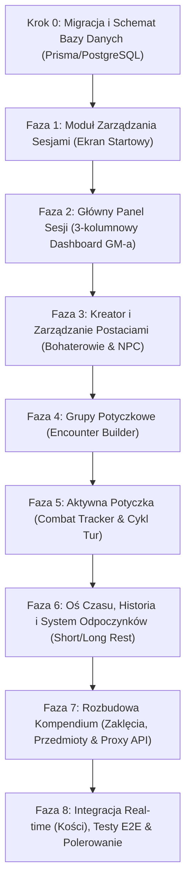

# Plan Implementacji Aplikacji Game Master Tracker (D&D 5e / TableOps)

> Dokument przygotowany na podstawie specyfikacji technicznej, schematu bazy danych oraz historyjek użytkownika zawartych w katalogu `user-stories-and-spec/`.  
> Wszystkie moduły są podzielone na małe, weryfikowalne kroki (chunki) z precyzyjnymi kryteriami testowymi.  
> **Standard wizualny:** Kontynuacja istniejącego, dopracowanego stylu dark-mode / glassmorphism (`#090d16`, akcenty `indigo`/`amber`, Tailwind CSS v4, biblioteka ikon `lucide-react`, panele `glass-card`).

---

## 🎨 Wytyczne Spójności Wizualnej (Design System)

Wszystkie nowe widoki i komponenty **muszą** ściśle bazować na dotychczas zaimplementowanym stylu w [src/app/globals.css](file:///Users/lukaszkosobucki/Documents/table-ops/src/app/globals.css) i [src/components/MainDashboard.tsx](file:///Users/lukaszkosobucki/Documents/table-ops/src/components/MainDashboard.tsx):

* **Tło i paleta bazowa:** Głęboka czerń/granat `#090d16` (background), `#0f172a` (karty i panele), obramowania `border-slate-800/80` lub `border-slate-700/60`.
* **Kolory wiodące (Akcenty):**
  * **Primary (Magia / System):** Indigo (`#6366f1` / `bg-gradient-to-r from-indigo-600 to-indigo-700`).
  * **Accent (Mistrz Gry / D&D / Ogień):** Amber/Gold (`#d97706` / `text-amber-400`).
  * **Wskaźniki stanu życia:**
    * Żywy / Zdolny do walki: szmaragdowa kropka `w-2.5 h-2.5 rounded-full bg-emerald-500 shadow-sm shadow-emerald-500/50`.
    * Nieprzytomny / Martwy (HP = 0): czerwony badge `text-rose-400 bg-rose-500/10 border border-rose-500/30` z ikoną czaszki (`Skull`).
* **Efekty szkła (Glassmorphism):**
  * `.glass-panel`: `bg-slate-900/75 backdrop-blur-md border border-white/5`.
  * `.glass-card`: `bg-slate-800/60 backdrop-blur-sm border border-white/5 hover:border-indigo-500/40 hover:shadow-indigo-500/10`.
* **Typografia i dane:** Bezszeryfowy tekst podstawowy (`font-sans`), dane mechaniczne (statystyki, rzuty kośćmi, modyfikatory, obrażenia, logi czasu) w kroju `font-mono`.
* **Responsywność:** 3-kolumnowy kokpit GM-a na dużych ekranach, który na mniejszych ekranach składa się w intuicyjne zakładki lub wysuwane panele boczne (Drawers).

---

## 🗺️ Mapa Drogowa Implementacji (Roadmap)

---

## KROK 0: Aktualizacja Schematu Bazy Danych (Prisma / PostgreSQL)

*Cel:* Zsynchronizowanie pliku [prisma/schema.prisma](file:///Users/lukaszkosobucki/Documents/table-ops/prisma/schema.prisma) ze specyfikacją [schemat_bazy_danych.md](file:///Users/lukaszkosobucki/Documents/table-ops/user-stories-and-spec/schemat_bazy_danych.md). Głównym korzeniem logiki staje się encja `Session`.

### Chunk 0.1: Modele Sesji, Postaci i Potyczek w Prisma
* **Backend:**
  * Utworzenie modelu `Session` (`id`, `name`, `createdAt`, `updatedAt`).
  * Aktualizacja modelu `Character` (`sessionId`, `type` [HERO/NPC], `name`, `class`, `level`, `maxHp`, `currentHp`, `ac`, `stats` [JSON], `proficiencies` [JSON], `traits` [JSON], `inventory` [JSON], `spells` [JSON]).
  * Dodanie modeli grup potyczkowych: `EncounterGroup` (`id`, `sessionId`, `name`) oraz `EncounterMember` (`id`, `groupId`, `characterId?`, `apiMonsterId?`, `count`).
  * Dodanie modeli aktywnej walki: `Combat` (`id`, `sessionId`, `status` [PREPARING/ACTIVE/FINISHED], `currentRound`, `currentTurnIndex`, `createdAt`, `endedAt`), `Combatant` (`id`, `combatId`, `characterId?`, `apiMonsterId?`, `nameOverride`, `initiative`, `currentHp`, `maxHp`, `ac`, `order`), `CombatStatus` (`id`, `combatantId`, `statusName`, `durationTurns`).
  * Dodanie modelu historii: `SessionLog` (`id`, `sessionId`, `combatId?`, `logType` [REST_SHORT/REST_LONG/COMBAT_END/SPELL_CAST/COMBAT_ACTION], `description`, `metadata` [JSON], `createdAt`).
  * Zachowanie i powiązanie z istniejącym modelem `Monster`.
* **Weryfikacja / Testy:**
  * Wykonanie `npm run prisma:generate` oraz `npm run prisma:push`.
  * Weryfikacja poprawności generowanych typów TypeScript w `node_modules/@prisma/client`.

---

## FAZA 1: Moduł Zarządzania Sesjami (Ekran Startowy)
*User Stories:* [user_stories_modu_sesji.md](file:///Users/lukaszkosobucki/Documents/table-ops/user-stories-and-spec/user_stories_modu_sesji.md)  
*API Spec:* [wymagania_crud_api.md](file:///Users/lukaszkosobucki/Documents/table-ops/user-stories-and-spec/wymagania_crud_api.md) (Sekcja 1)

### Chunk 1.1: Backend – CRUD Sesji
* **Backend:**
  * Endpoint `GET /api/sessions`: zwraca listę sesji posortowaną po `updatedAt DESC` wraz z zagregowaną liczbą przypisanych postaci i logów.
  * Endpoint `POST /api/sessions`: walidacja nazwy (min. 2 znaki, max. 60 znaków) i utworzenie nowej sesji.
  * Endpoint `PUT /api/sessions/[id]`: aktualizacja nazwy sesji.
  * Endpoint `DELETE /api/sessions/[id]`: kaskadowe usunięcie sesji i wszystkich przypisanych do niej rekordów.
* **Testowanie:**
  * Wywołanie testowe API (cURL / skrypt `tsx`): utworzenie sesji "Kampania Strahda", edycja na "Klątwa Strahda", pobranie listy, usunięcie.
  * Sprawdzenie odporności: fallback przy braku połączenia z bazą (zapis w local state/storage w trybie offline).

### Chunk 1.2: Frontend – Ekran Wyboru i Zarządzania Sesjami
* **Frontend:**
  * Stworzenie komponentu widoku startowego `SessionSelector.tsx`.
  * Kafelki sesji w stylu `glass-card`: nazwa sesji, data ostatniej modyfikacji, liczba bohaterów, przycisk wejścia ("Prowadź sesję →").
  * Przycisk "+" (Nowa Sesja) otwierający modal w stylu `glass-panel` z polem wprowadzania nazwy.
  * Menu kontekstowe kafelka: szybka edycja nazwy oraz usunięcie sesji z modalem potwierdzenia (ochrona przed przypadkowym skasowaniem).
  * Zapisanie ID wybranej sesji w URL (`/session/[id]` lub stan w URL query params dla płynnego odświeżania).
* **Testowanie:**
  * Utworzenie 2 testowych sesji z poziomu przeglądarki.
  * Zmiana nazwy jednej z nich, sprawdzenie odświeżenia widoku.
  * Wejście do sesji – weryfikacja czy stan aktywnej sesji jest przekazywany do nadrzędnego komponentu.

---

## FAZA 2: Główny Panel Sesji (3-kolumnowy Dashboard GM-a)
*User Stories:* [user_stories_g_wny_panel_sesji.md](file:///Users/lukaszkosobucki/Documents/table-ops/user-stories-and-spec/user_stories_g_wny_panel_sesji.md)  
*Specyfikacja:* [specyfikacja_aplikacji_rpg_tracker.md](file:///Users/lukaszkosobucki/Documents/table-ops/user-stories-and-spec/specyfikacja_aplikacji_rpg_tracker.md) (Sekcja 3)

### Chunk 2.1: Backend – Full-State Session Endpoint
* **Backend:**
  * Endpoint `GET /api/sessions/[id]/full-state`:
    * Zwraca w jednym szybkim zapytaniu: dane sesji, listę postaci (Bohaterowie i NPC), ostatnie 30 wpisów osi czasu oraz stan aktywnej/przygotowywanej walki.
    * Zapewnia natychmiastowe załadowanie aplikacji po wejściu w sesję bez konieczności odpytywania kilku endpointów kaskadowo.
* **Testowanie:**
  * Wywołanie endpointu dla wybranej sesji – weryfikacja poprawności formatu JSON i relacji.

### Chunk 2.2: Frontend – Implementacja 3-kolumnowego Układu Kokpitu
* **Frontend:**
  * Przebudowa [src/components/MainDashboard.tsx](file:///Users/lukaszkosobucki/Documents/table-ops/src/components/MainDashboard.tsx) dla widoku `dashboard`:
  * **Lewa Kolumna (Lista Uczestników):**
    * Lista postaci podzielona na sekcje: "Bohaterowie Graczy" oraz "Ważni NPC".
    * Wskaźnik HP: zielona kropka gdy `currentHp > 0`, czerwona ikona czaszki gdy `currentHp === 0`.
    * Pasek życia (HP mini-bar), wartość AC, klasa i poziom.
    * Kliknięcie postaci zaznacza ją i przekazuje do Środkowej Kolumny.
  * **Prawa Kolumna (Oś Czasu / Historia):**
    * Lista zdarzeń z sygnaturami czasowymi i badge'ami typów (np. fioletowy `Odpoczynek`, złoty `Zaklęcie`, karmazynowy `Walka`).
    * Szybkie przyciski akcji na szczycie kolumny: "Krótki odpoczynek", "Długi odpoczynek", "Własna notatka".
    * Kliknięcie wpisu zaznacza go i przekazuje do Środkowej Kolumny.
  * **Środkowa Kolumna (Dynamiczny Viewport):**
    * **Tryb Postaci:** Karta szybkiego podglądu do odgrywania (LARP) – cechy charakteru, motywacje, wygląd, skrót statystyk (D20 rzut cechy), ekwipunek, zaklęcia.
    * **Tryb Historii:** Karta szczegółów wybranego wydarzenia (np. pełne statystyki zakończonej potyczki: kto ile przyjął obrażeń, ile tur trwała).
    * **Tryb Domyślny:** Karta powitalna sesji z podsumowaniem stanu drużyny, gdy nic nie jest wybrane.
* **Testowanie:**
  * Test interakcji: kliknięcie w postać -> natychmiastowa zmiana widoku w środku.
  * Kliknięcie w log z prawej kolumny -> wyświetlenie podsumowania zdarzenia w środku.
  * Weryfikacja responsywności na ekranach laptopów i tabletów.

---

## FAZA 3: Moduł Kreatora i Kart Postaci (Bohaterowie & NPC)
*User Stories:* [user_stories_modu_postaci.md](file:///Users/lukaszkosobucki/Documents/table-ops/user-stories-and-spec/user_stories_modu_postaci.md)  
*API Spec:* [wymagania_crud_api.md](file:///Users/lukaszkosobucki/Documents/table-ops/user-stories-and-spec/wymagania_crud_api.md) (Sekcja 2)

### Chunk 3.1: Backend – Zarządzanie Postaciami i Automatyka Slotów Czarów
* **Backend:**
  * `GET /api/sessions/[id]/characters` – pobieranie bohaterów i NPC danej sesji.
  * `POST /api/sessions/[id]/characters` – tworzenie postaci:
    * Logika kalkulacji slotów czarów w zależności od klasy (Wizard, Cleric, Paladin, etc.) i poziomu zgodnie z regułami D&D 5e SRD.
    * Sztuczki (Cantrips) jako zaklęcia bezlimitowe, czary 1-9 poziomu z pulą slotów `total` oraz `used: 0`.
  * `PUT /api/characters/[char_id]` – aktualizacja postaci (modyfikacja HP, zużycie slotu czaru, dodanie przedmiotu, edycja cech).
  * `DELETE /api/characters/[char_id]` – usunięcie postaci z sesji.
* **Testowanie:**
  * Test tworzenia Czarodzieja poziomu 3 – weryfikacja wygenerowania 4 slotów 1. poziomu i 2 slotów 2. poziomu.
  * Test edycji HP i zużycia slotu czaru przez API.

### Chunk 3.2: Frontend – Integracja Kreatora i Karta Postaci
* **Frontend:**
  * Rozbudowa [src/components/CharacterWizard.tsx](file:///Users/lukaszkosobucki/Documents/table-ops/src/components/CharacterWizard.tsx):
    * Dodanie przełącznika typu: "Bohater Gracza" vs "Ważny NPC".
    * Pola obowiązkowe: Imię, Rasa, Klasa, Poziom, Atrybuty (STR/DEX/CON/INT/WIS/CHA), Biegłości, min. 1 Cecha charakteru / motywacja.
    * Pola opcjonalne: Ekwipunek, dodatkowe notatki, zaklęcia.
    * Sekcja Zarządzania Slotami Czarów: interaktywne przełączniki (checkboxy/bąbelki) zużytych slotów.
    * Zapisywanie bezpośrednio do bazy aktywnej sesji przez API.
  * Zakładka przeglądania wszystkich kart postaci w sesji z filtrem Hero/NPC.
* **Testowanie:**
  * Przejście całego kreatora dla nowej postaci.
  * Sprawdzenie, czy po zapisie postać natychmiast pojawia się na liście postaci oraz w Lewej Kolumnie Głównego Panelu Sesji.
  * Zmiana HP postaci na karcie i weryfikacja automatycznej aktualizacji wskaźnika życia (zielona kropka / czaszka).

---

## FAZA 4: Grupy Potyczkowe (Encounter Builder)
*User Stories:* [user_stories_modu_potyczek.md](file:///Users/lukaszkosobucki/Documents/table-ops/user-stories-and-spec/user_stories_modu_potyczek.md) (Pkt 1)  
*API Spec:* [wymagania_crud_api.md](file:///Users/lukaszkosobucki/Documents/table-ops/user-stories-and-spec/wymagania_crud_api.md) (Sekcja 3)

### Chunk 4.1: Backend – Predefiniowane Grupy Przeciwników
* **Backend:**
  * `GET /api/sessions/[id]/encounter-groups` – lista grup potyczkowych z członkami grupy.
  * `POST /api/sessions/[id]/encounter-groups` – utworzenie grupy (np. `{ name: "Zasadzka Goblinów", members: [{ apiMonsterId: "goblin", count: 4 }] }`).
  * `PUT /api/encounter-groups/[group_id]` – modyfikacja składu grupy.
  * `DELETE /api/encounter-groups/[group_id]` – usunięcie grupy.
* **Testowanie:**
  * Utworzenie grupy przez API z 3 potworami, aktualizacja liczebności, pobranie i usunięcie.

### Chunk 4.2: Frontend – Widok Przygotowywania Potyczek
* **Frontend:**
  * Nowa podzakładka w module walki lub modal "Kreator Grup Potyczkowych":
    * Tworzenie i nazwanie nowej grupy (np. "Loch: Sala Strażników").
    * Wyszukiwarka potworów z Bestiariusza (współdzielona z [src/components/Bestiary.tsx](file:///Users/lukaszkosobucki/Documents/table-ops/src/components/Bestiary.tsx)) z przyciskiem "+ Dodaj do grupy".
    * Licznik potworów danego typu (np. Goblin x3) oraz możliwość dodania NPC z sesji.
    * Kalkulator sumarycznego XP i wskaźnik szacowanej trudności (Łatwa / Średnia / Trudna / Śmiertelna) na podstawie liczby i poziomów bohaterów w sesji.
* **Testowanie:**
  * Utworzenie grupy "Wilcza wataha" z 4 wilkami, zapisanie grupy i ponowne otwarcie – dane muszą pozostać nienaruszone.

---

## FAZA 5: Aktywna Potyczka (Combat Tracker & Cykl Walki)
*User Stories:* [user_stories_modu_potyczek.md](file:///Users/lukaszkosobucki/Documents/table-ops/user-stories-and-spec/user_stories_modu_potyczek.md) (Pkt 2–7)  
*API Spec:* [wymagania_crud_api.md](file:///Users/lukaszkosobucki/Documents/table-ops/user-stories-and-spec/wymagania_crud_api.md) (Sekcja 4)

### Chunk 5.1: Backend – Maszyna Stanów Walki i Logika Tur
* **Backend:**
  * `POST /api/sessions/[id]/combat` – tworzy instancję walki w stanie `PREPARING`.
  * `POST /api/combat/[combat_id]/participants` – dodaje uczestników (zapisane grupy potyczkowe, pojedyncze potwory z Bestiariusza, wybrani bohaterowie sesji).
  * `PUT /api/combat/[combat_id]/initiative` – zapis wartości inicjatywy dla każdego uczestnika.
  * `POST /api/combat/[combat_id]/start` – sortuje listę malejąco wg inicjatywy, zamraża kolejność, ustawia `status: 'ACTIVE'`, `currentRound: 1`, `currentTurnIndex: 0`.
  * `POST /api/combat/[combat_id]/next-turn`:
    * Przesuwa wskaźnik tury na kolejnego żywego uczestnika.
    * Po zakończeniu cyklu wszystkich uczestników: inkrementuje `currentRound`.
    * Automatyczne odliczanie statusów: dekrementacja `durationTurns` dla statusów aktywnego uczestnika, usunięcie statusów gdy `durationTurns <= 0`.
    * Wygenerowanie wpisu do logów walki (`COMBAT_ACTION`).
  * `PUT /api/combat/[combat_id]/combatant/[combatant_id]`:
    * Zmiana HP (obrażenia / leczenie).
    * Dodanie statusu ze wskazaną liczbą tur (np. `Poisoned`, 3 tury).
  * `POST /api/combat/[combat_id]/end`:
    * Zmienia status na `FINISHED`, ustawia `endedAt`.
    * **Kluczowa automatyzacja:** przepisanie aktualnego HP bohaterów graczy z tabeli `combatants` do głównej tabeli `characters`.
    * Wypchnięcie wpisu `COMBAT_END` do `session_logs` sesji z metadanymi (czas trwania, liczba rund, polegli przeciwnicy, odniesione rany).
* **Testowanie:**
  * Pełny test scenariusza API: start walki -> rzut inicjatywy -> start -> next-turn -> zadanie obrażeń -> nałożenie statusu -> koniec walki -> weryfikacja zaktualizowanego HP bohatera w bazie.

### Chunk 5.2: Frontend – Interaktywny Ekran Walki (Combat Tracker)
* **Frontend:**
  * Ewolucja [src/components/InitiativeTracker.tsx](file:///Users/lukaszkosobucki/Documents/table-ops/src/components/InitiativeTracker.tsx):
  * **Krok 1 (Faza PREPARING):**
    * Wybór grupy potyczkowej lub ręczne dodanie potworów i bohaterów.
    * Przycisk "Rzuć inicjatywę automatycznie" (d20 + modyfikator ze zręczności) oraz pola do wpisania ręcznego (gdy gracze rzucają fizycznymi kośćmi).
    * Wyróżniony przycisk **"⚔️ Rozpocznij Walkę"** blokujący edycję kolejności.
  * **Krok 2 (Faza ACTIVE):**
    * Wyraźny wskaźnik aktywnej tury (złote obramowanie karty aktywnego uczestnika, informacja "Kto teraz" / "Kto następny").
    * Przycisk **"Następna Tura ➔"** i licznik rund ("Runda 1").
    * Szybkie kontrolki HP: przyciski obrażeń (`-1`, `-5`, `-10`, custom input) i leczenia (`+1`, `+5`, custom).
    * Nakładanie statusów: dropdown stanów D&D 5e z polem "Liczba tur" (np. 1 runda, 3 rundy).
    * Bąbelki aktywnych statusów z licznikiem pozostałych tur obok paska życia.
    * Mini-okno "Combat Log" na bieżąco pokazujące ostatnie zdarzenia w walce.
  * **Krok 3 (Faza FINISHED):**
    * Przycisk "Zakończ Walkę" z podsumowaniem i opcją powrotu do Głównego Panelu Sesji.
* **Testowanie:**
  * Przeprowadzenie 3 pełnych rund walki z poziomu interfejsu.
  * Weryfikacja odliczania i samoczynnego zniknięcia statusu po zadanej liczbie tur.
  * Zakończenie walki – weryfikacja czy w lewej kolumnie Dashboardu HP postaci graczy zaktualizowało się automatycznie.

---

## FAZA 6: Oś Czasu, Historia i System Odpoczynków
*User Stories:* [user_stories_modu_historii.md](file:///Users/lukaszkosobucki/Documents/table-ops/user-stories-and-spec/user_stories_modu_historii.md)  
*API Spec:* [wymagania_crud_api.md](file:///Users/lukaszkosobucki/Documents/table-ops/user-stories-and-spec/wymagania_crud_api.md) (Sekcja 5)

### Chunk 6.1: Backend – Obsługa Logów i Automatyka Odpoczynków
* **Backend:**
  * `GET /api/sessions/[id]/logs` – pobieranie chronologicznej listy zdarzeń sesji.
  * `POST /api/sessions/[id]/logs` – dodanie zdarzenia:
    * Typ `REST_SHORT`: dodanie wpisu oraz opcjonalne wydanie Kości Wytrzymałości (Hit Dice).
    * Typ `REST_LONG`: automatyczna regeneracja tabeli `characters` dla wszystkich bohaterów sesji (przywrócenie `currentHp = maxHp`, zresetowanie zużytych slotów czarów `used: 0`), wygenerowanie podsumowującego wpisu na osi czasu.
    * Typ `SPELL_CAST` / `CUSTOM_NOTE`: rejestracja użycia czaru lub notatki narracyjnej GM-a.
  * `GET /api/combat/[combat_id]/logs` – pobranie szczegółowego logu aktywnej lub zakończonej potyczki.
* **Testowanie:**
  * Wywołanie `POST /api/sessions/[id]/logs` z typem `REST_LONG` dla postaci z 5/20 HP – sprawdzenie, czy w bazie postać ma natychmiast 20/20 HP oraz odnowione sloty.

### Chunk 6.2: Frontend – Interaktywna Oś Czasu i Modale Odpoczynków
* **Frontend:**
  * Rozbudowa Prawej Kolumny Dashboardu:
    * Wizualny timeline ze wskaźnikami godzinowymi (`18:42`, `19:15`).
    * Filtrowanie zdarzeń: "Wszystko", "Tylko walki", "Odpoczynki", "Zaklęcia i akcje".
    * Modal "Krótki Odpoczynek (1 godzina)" z wyborem postaci.
    * Modal "Długi Odpoczynek (8 godzin)" z podsumowaniem zregenerowanych HP i slotów czarów.
    * Przycisk dodania szybkiej notatki fabularnej (np. "Drużyna dotarła do karczmy Pod Rozbrykanym Kucykiem").
  * Obsługa widoku podsumowania zdarzenia w Środkowej Kolumnie po kliknięciu wpisu z Osi Czasu.
* **Testowanie:**
  * Przetestowanie wykonania Długiego Odpoczynku w UI – sprawdzenie animacji i odświeżenia pasków życia bohaterów w Lewej Kolumnie.

---

## FAZA 7: Rozbudowa Kompendium (Zaklęcia, Przedmioty i Integracja)
*Specyfikacja:* [specyfikacja_aplikacji_rpg_tracker.md](file:///Users/lukaszkosobucki/Documents/table-ops/user-stories-and-spec/specyfikacja_aplikacji_rpg_tracker.md) (Sekcja 1)  
*API Spec:* [wymagania_crud_api.md](file:///Users/lukaszkosobucki/Documents/table-ops/user-stories-and-spec/wymagania_crud_api.md) (Sekcja 6)

### Chunk 7.1: Backend – Seed i API Zaklęć oraz Przedmiotów
* **Backend:**
  * Skrypt seedujący / wrapper dla D&D 5e SRD API (podobnie jak dla potworów):
    * `GET /api/compendium/spells?search=...&level=...&school=...`
    * `GET /api/compendium/items?search=...&type=...`
    * `GET /api/compendium/monsters?search=...` (zintegrowany z istniejącym [src/lib/monsters.ts](file:///Users/lukaszkosobucki/Documents/table-ops/src/lib/monsters.ts)).
  * Lokalne pliki seed JSON (`prisma/spells_seed.json`, `prisma/items_seed.json`) dla bezbłędnego działania offline.
* **Testowanie:**
  * Weryfikacja endpointów kompendium, poprawności filtrów i czasów odpowiedzi poniżej 50ms w trybie offline/cache.

### Chunk 7.2: Frontend – Przeglądarka Kompendium i Dodawanie do Karty
* **Frontend:**
  * Rozszerzenie zakładki "Bestiariusz" w pełne "Kompendium D&D 5e":
    * Zakładki: Bestiariusz (istniejący [src/components/Bestiary.tsx](file:///Users/lukaszkosobucki/Documents/table-ops/src/components/Bestiary.tsx)), Zaklęcia (Spells), Ekwipunek (Items).
    * Karty zaklęć: poziom, szkoła magii, czas rzucania, zasięg, komponenty, opis.
    * Akcja: **"+ Dodaj do postaci"** – pozwala z poziomu karty czaru/przedmiotu przypisać go od razu wybranemu bohaterowi sesji.
* **Testowanie:**
  * Wyszukanie czaru "Cure Wounds", przypisanie go do postaci Kleryka, otwarcie karty Kleryka w Dashboardzie i weryfikacja obecności czaru w jego liście.

---

## FAZA 8: Integracja Real-time (Kości), Testy E2E i Polerowanie

### Chunk 8.1: Narzędzia Rzutów Kośćmi w Kokpicie GM-a
* **Frontend / Backend:**
  * Integracja istniejącego [src/components/DiceRoller.tsx](file:///Users/lukaszkosobucki/Documents/table-ops/src/components/DiceRoller.tsx) z akcjami w Dashboardzie:
    * Kliknięcie atrybutu postaci (np. `STR 16 (+3)`) w karcie środkowej kolumny wykonuje rzut D20 + modyfikator w podręcznym rollerze.
    * Opcja "Wyślij wynik rzutu do Osi Czasu Sesji".
* **Testowanie:**
  * Wykonanie rzutu z poziomu karty postaci – weryfikacja poprawności obliczenia modyfikatora i dodania wpisu do historii.

### Chunk 8.2: Testy Integracyjne (End-to-End Walkthrough)
* **Weryfikacja pełnego scenariusza sesji:**
  1. Otwarcie aplikacji -> Ekran sesji -> Utworzenie nowej sesji ("Przygoda w Phandalin").
  2. Wejście do sesji -> 3-kolumnowy dashboard.
  3. Stworzenie 2 bohaterów w kreatorze (Wojownik i Czarodziej) oraz 1 NPC.
  4. Przygotowanie grupy potyczkowej z 3 Goblinami.
  5. Rozpoczęcie walki: wylosowanie inicjatywy, zadanie obrażeń bohaterowi, nałożenie statusu trucizny na 2 rundy.
  6. Przejście 2 rund walki -> automatyczne wygaśnięcie statusu -> pokonanie goblinów.
  7. Zakończenie walki -> weryfikacja automatycznego zapisu obniżonego HP bohatera.
  8. Obejrzenie podsumowania walki na Osi Czasu w Środkowej Kolumnie.
  9. Wykonanie Długiego Odpoczynku -> weryfikacja powrotu HP do wartości maksymalnej i odnowienia slotów czarów.
  10. Sprawdzenie lintera (`npm run lint`) i produkcyjnego buildu (`npm run build`).

---

## 📋 Matryca Zależności Zadań

| Etap | Zadanie | Zależności | Czas realizacji (orientacyjny) |
| :--- | :--- | :--- | :--- |
| **Krok 0** | Aktualizacja schematu Prisma (`schema.prisma`) | *Brak* | 1 chunk |
| **Faza 1** | Backend CRUD Sesji + UI Wyboru Sesji | Krok 0 | 2 chunki |
| **Faza 2** | Full-state API + 3-Kolumnowy Dashboard | Faza 1 | 2 chunki |
| **Faza 3** | CRUD Postaci + Kreator z automatyką slotów czarów | Faza 2 | 2 chunki |
| **Faza 4** | Grupy Potyczkowe (Encounter Builder) | Faza 3 | 2 chunki |
| **Faza 5** | Combat Tracker (Maszyna stanów, tury, statusy, HP) | Faza 4 | 2 chunki |
| **Faza 6** | Oś Czasu, Historia i System Odpoczynków | Faza 5 | 2 chunki |
| **Faza 7** | Kompendium (Zaklęcia, Przedmioty, seed offline) | Faza 3 | 2 chunki |
| **Faza 8** | Integracja rzutów kośćmi, weryfikacja E2E | Faza 1-7 | 2 chunki |