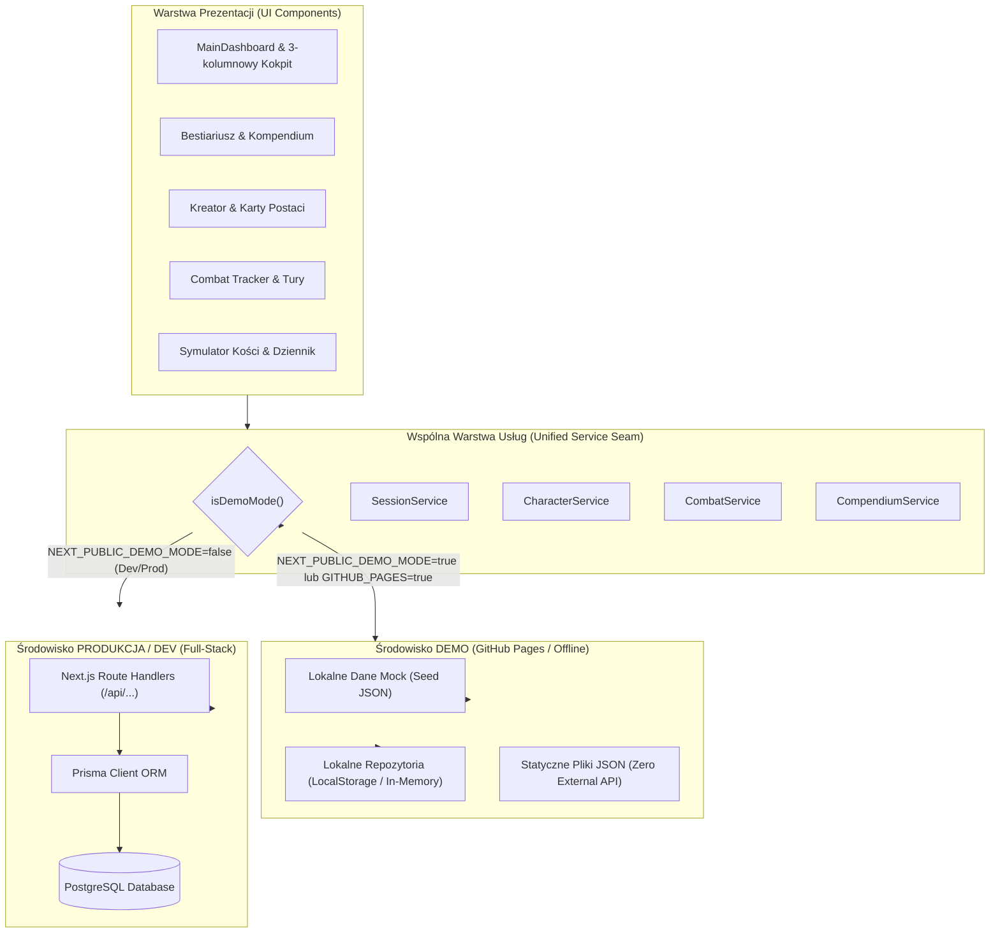
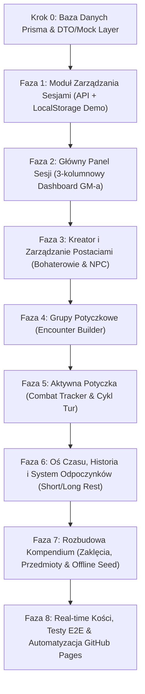

# Plan Implementacji Aplikacji Game Master Tracker (D&D 5e / TableOps)

> Dokument przygotowany na podstawie specyfikacji technicznej, schematu bazy danych oraz historyjek użytkownika zawartych w katalogu `user-stories-and-spec/`.  
> Wszystkie moduły są podzielone na małe, weryfikowalne kroki (chunki) z precyzyjnymi kryteriami testowymi.  
> **Architektura podwójnego środowiska:** Każda funkcja posiada precyzyjnie określone zachowanie w **Środowisku Produkcyjnym/Dev (PostgreSQL + Prisma + Next.js API Routes)** oraz w **Środowisku Demo (GitHub Pages / Mock-first / Zero External API)**.  
> **Standard wizualny:** Ścisła kontynuacja stylu dark fantasy / glassmorphism (`#090d16`, akcenty `indigo`/`amber`, Tailwind CSS v4, biblioteka ikon `lucide-react`, panele `glass-card`).

---

## 🏗️ 1. Architektura Dwóch Środowisk: Demo (Mock-first) vs. Prod/Dev (Full-Stack DB)

Aby umożliwić bezproblemowe wdrażanie aplikacji na **GitHub Pages** (wersja pokazowa/portfolio) oraz stabilną pracę w chmurze lub lokalnym serwerze (z bazą PostgreSQL), cała architektura opiera się na **Wzorcu Repozytorium / Adapterów (Hexagonal Architecture)**.

### Kluczowe zasady architektury podwójnego środowiska:

1. **Brak bezpośrednich zapytań `fetch` lub Prisma w komponentach UI:**
   - Komponenty UI korzystają wyłącznie ze zunifikowanych serwisów (`sessionService`, `characterService`, `combatService`, `compendiumService`).
   - Serwis na podstawie `isDemoMode()` automatycznie wybiera `MockAdapter` lub `ApiAdapter`.
2. **Gwarancja środowiska DEMO (GitHub Pages):**
   - **Zero zewnętrznych zapytań HTTP do API:** Wszystkie dane (sesje, postacie, grupy potyczkowe, historia) są emulowane w pamięci oraz utrwalane w `localStorage`.
   - **Niezmienne seedowane kompendium:** Bestiariusz, czary i przedmioty czytane są z prekompilowanych statycznych struktur JSON.
   - **Statyczny eksport (`output: 'export'`):** Build tworzy w 100% statyczne pliki HTML/CSS/JS, deployowane bezpośrednio na GitHub Pages.
3. **Środowisko PRODUKCYJNE / DEV:**
   - Zapytania trafiają do endpointów `/api/...` obsługiwanych przez Next.js Server Actions / Route Handlers.
   - Dane są trwale zapisywane w relacyjnej bazie danych PostgreSQL przez Prisma ORM.
   - Posiada automatyczne transakcje bazodanowe, kaskadowe usuwanie powiązań i pełną integralność danych.
4. **Wskaźnik środowiska w UI:**
   - Subtelna odznaka w nagłówku ([`src/components/layout/Navbar.tsx`](file:///Users/lukaszkosobucki/Documents/table-ops/src/components/layout/Navbar.tsx)) informująca użytkownika o trybie pracy:
     - `[DEMO: Dane Lokalne]` (bursztynowy badge w trybie demo)
     - `[PROD: PostgreSQL]` / `[DEV: Baza Lokalna]` (szmaragdowy badge w trybie pełnym).

---

## 🎨 2. Wytyczne Spójności Wizualnej (Design System)

Wszystkie nowe widoki i komponenty **muszą** ściśle bazować na stylu zdefiniowanym w [`STYLEGUIDE.MD`](file:///Users/lukaszkosobucki/Documents/table-ops/STYLEGUIDE.MD), [`src/app/globals.css`](file:///Users/lukaszkosobucki/Documents/table-ops/src/app/globals.css) i [`src/lib/theme.ts`](file:///Users/lukaszkosobucki/Documents/table-ops/src/lib/theme.ts):

* **Tło i paleta bazowa:** Głęboka czerń/granat `#090d16` (background), `rgba(15, 23, 42, 0.75)` (panele), `rgba(15, 23, 42, 0.6)` (karty), obramowania `border-slate-800/80`.
* **Kolory wiodące (Akcenty):**
  * **Primary (Magia / Akcje systemowe):** Indigo (`#6366f1` / `.btn-indigo` / `border-indigo-500/50`).
  * **Accent (Mistrz Gry / D&D / Złoto):** Amber (`#f59e0b` / `.btn-primary` złoty gradient / `text-amber-400`).
* **Wskaźniki stanu życia (Health Status):**
  * Zdrowy (`> 50% HP`): Szmaragdowy (`#10b981` / `bg-emerald-500`).
  * Ranny (`<= 50% HP`): Bursztynowy (`#f59e0b` / `bg-amber-500`).
  * Krytyczny (`<= 20% HP`): Pulsujący pomarańczowy (`#f97316` / `bg-orange-500 animate-pulse`).
  * Nieprzytomny / Martwy (`0 HP`): Karmazynowy badge z ikoną czaszki (`Skull`, `text-red-400`).
* **Efekty szkła:** Klasy `.glass-panel`, `.glass-card`, `.glass-card-interactive`.
* **Typografia:** Bezszeryfowy tekst ogólny (`font-sans`), liczby i mechanika gry (HP, AC, kości, rzuty, godziny) w `font-mono`.

---

## 🗺️ 3. Zaktualizowana Mapa Drogowa Implementacji

---

## KROK 0: Schemat Bazy Danych Prisma & Architektura Adapterów Danych

*Cel:* Przygotowanie modeli Prisma PostgreSQL oraz wspólnych interfejsów DTO i adaptera mocków dla środowiska demo.

### Chunk 0.1: Schemat Prisma dla Produkcji / Dev
* **Backend (Prod/Dev):**
  * Utworzenie modelu `Session` (`id`, `name`, `createdAt`, `updatedAt`).
  * Model `Character` (`sessionId`, `type` [HERO/NPC], `name`, `class`, `level`, `maxHp`, `currentHp`, `ac`, `stats` [JSON], `proficiencies` [JSON], `traits` [JSON], `inventory` [JSON], `spells` [JSON]).
  * Modele grup: `EncounterGroup` (`id`, `sessionId`, `name`), `EncounterMember` (`id`, `groupId`, `characterId?`, `apiMonsterId?`, `count`).
  * Modele walki: `Combat` (`id`, `sessionId`, `status` [PREPARING/ACTIVE/FINISHED], `currentRound`, `currentTurnIndex`), `Combatant` (`id`, `combatId`, `characterId?`, `apiMonsterId?`, `nameOverride`, `initiative`, `currentHp`, `maxHp`, `ac`, `order`), `CombatStatus` (`id`, `combatantId`, `statusName`, `durationTurns`).
  * Model historii: `SessionLog` (`id`, `sessionId`, `combatId?`, `logType`, `description`, `metadata` [JSON], `createdAt`).
  * Wygenerowanie migracji Prisma (`npx prisma generate`).

### Chunk 0.2: Wspólne Interfejsy DTO & Mock Factory dla Demo
* **Wspólne DTO / Types (`src/types/`):**
  * Zdefiniowanie uniwersalnych interfejsów TypeScript reprezentujących sesje, postacie, grupy, walkę i logi, niezależnych od silnika bazodanowego.
* **Warstwa Demo (`src/lib/mock-data.ts`):**
  * Rozbudowa generatora danych demonstracyjnych z początkowymi danymi:
    * 2 gotowe sesje: "Klątwa Strahda (Barovia)", "Kopalnia Phandelvera".
    * 4 predefiniowane postacie graczy i 2 ważnych NPC.
    * 2 gotowe grupy potyczkowe ("Zasadzka Wilków", "Straż Przednia Goblinów").
    * Wstępna historia zdarzeń na osi czasu.
* **Testowanie / Weryfikacja:**
  * Test jednostkowy w Vitest weryfikujący poprawność struktury danych mockowych i zgodność z interfejsami DTO.

---

## FAZA 1: Moduł Zarządzania Sesjami (Ekran Startowy)
*User Stories:* `user-stories-and-spec/user_stories_modu_sesji.md`  
*API Spec:* `user-stories-and-spec/wymagania_crud_api.md` (Sekcja 1)

### Chunk 1.1: Warstwa Danych Sesji (Podwójna Implementacja)
* **Środowisko Produkcyjne/Dev (`src/lib/services/session-api.ts` & `/api/sessions`):**
  * `GET /api/sessions` – pobieranie sesji z bazy PostgreSQL posortowanych po `updatedAt DESC` z relacjami.
  * `POST /api/sessions` – walidacja Zod (min. 2 znaki, max. 60 znaków) i zapis w PostgreSQL.
  * `PUT /api/sessions/[id]` – aktualizacja nazwy.
  * `DELETE /api/sessions/[id]` – kaskadowe usunięcie sesji z PostgreSQL.
* **Środowisko Demo (`src/lib/services/session-mock.ts`):**
  * Obsługa w `localStorage` (z pamięcią podręczną in-memory).
  * Automatyczna inicjalizacja predefiniowanymi sesjami demo przy pierwszym wejściu.
  * Pełne wsparcie CRUD w przeglądarce bez otwierania jakichkolwiek połączeń sieciowych.
* **Weryfikacja / Testy:**
  * Vitest: testy jednostkowe `session-mock.ts` oraz walidacji parametrów sesji.
  * Sprawdzenie przełączania środowisk przy zmianie `NEXT_PUBLIC_DEMO_MODE`.

### Chunk 1.2: Frontend – Ekran Wyboru i Zarządzania Sesjami
* **Frontend:**
  * Komponent `SessionSelector.tsx`:
    * Kafelki sesji w stylu `glass-card`: nazwa, czas ostatniej modyfikacji, odznaka liczby bohaterów, przycisk wejścia ("Prowadź sesję →").
    * Przycisk "+" (Nowa Sesja) otwierający modal `glass-panel`.
    * Menu akcji: edycja nazwy oraz usunięcie sesji z modalem potwierdzenia.
    * Odznaka trybu środowiska w nagłówku (`[DEMO]` vs `[PROD]`).
* **Weryfikacja / Testy:**
  * Playwright E2E: Utworzenie nowej sesji, zmiana nazwy, usunięcie sesji testowej w trybie demo.

---

## FAZA 2: Główny Panel Sesji (3-kolumnowy Dashboard GM-a)
*User Stories:* `user-stories-and-spec/user_stories_g_wny_panel_sesji.md`  
*Specyfikacja:* `user-stories-and-spec/specyfikacja_aplikacji_rpg_tracker.md` (Sekcja 3)

### Chunk 2.1: Agregator Stanu Sesji (Full-State Provider)
* **Środowisko Produkcyjne/Dev:**
  * Endpoint `GET /api/sessions/[id]/full-state` zwracający w jednym zapytaniu SQL: dane sesji, postacie (bohaterowie + NPC), ostatnie 30 wpisów osi czasu i stan aktywnej potyczki.
* **Środowisko Demo:**
  * Serwis `mockSessionService.getFullState(id)` agregujący dane synchronicznie z lokalnego stanu mocków.
* **Weryfikacja / Testy:**
  * Vitest: Porównanie zgodności struktury zwracanego obiektu w obu środowiskach.

### Chunk 2.2: Frontend – 3-kolumnowy Kokpit Mistrza Gry
* **Frontend ([`src/components/MainDashboard.tsx`](file:///Users/lukaszkosobucki/Documents/table-ops/src/components/MainDashboard.tsx)):**
  * **Lewa Kolumna (Lista Uczestników):**
    * Podział na sekcje: "Bohaterowie Graczy" oraz "Ważni NPC".
    * Wskaźniki HP z kolorami progowymi (zielony >50%, bursztyn <=50%, pomarańcz <=20%, czaszka przy 0 HP).
    * Mini-bar HP, wartość AC, klasa, poziom oraz klikalne zaznaczenie.
  * **Prawa Kolumna (Oś Czasu / Historia):**
    * Chronologiczna lista zdarzeń z badge'ami typów (fioletowy Odpoczynek, złote Zaklęcie, karmazynowa Walka).
    * Szybkie przyciski akcji: "Krótki odpoczynek", "Długi odpoczynek", "Notatka fabularna".
  * **Środkowa Kolumna (Dynamiczny Viewport):**
    * Tryb podglądu postaci (karta LARP/RP z cechami charakteru, motywacjami, ekwipunkiem i rzutami).
    * Tryb szczegółów zdarzenia z osi czasu (podsumowanie potyczki lub odpoczynku).
    * Tryb domyślny: karta podsumowania stanu drużyny.
* **Weryfikacja / Testy:**
  * Playwright E2E: Kliknięcie postaci w lewej kolumnie -> aktualizacja środkowego viewportu. Kliknięcie logu w prawej kolumnie -> podgląd zdarzenia.

---

## FAZA 3: Moduł Kreatora i Kart Postaci (Bohaterowie & NPC)
*User Stories:* `user-stories-and-spec/user_stories_modu_postaci.md`  
*API Spec:* `user-stories-and-spec/wymagania_crud_api.md` (Sekcja 2)

### Chunk 3.1: Warstwa Danych Postaci & Automatyka Slotów Czarów
* **Środowisko Produkcyjne/Dev:**
  * Endpointy `GET/POST /api/sessions/[id]/characters` oraz `PUT/DELETE /api/characters/[charId]`.
  * Obliczanie slotów czarów D&D 5e SRD w zależności od klasy i poziomu.
* **Środowisko Demo:**
  * Serwis `mockCharacterService` z zapisem w `localStorage`.
  * Identyczna czysta logika matematyczna D&D ([`src/lib/dnd-rules.ts`](file:///Users/lukaszkosobucki/Documents/table-ops/src/lib/dnd-rules.ts)) bez narzutu serwerowego.
* **Weryfikacja / Testy:**
  * Vitest: Weryfikacja reguł slotów dla Czarodzieja 3. poziomu (4 sloty 1. kręgu, 2 sloty 2. kręgu) i Paladyna.

### Chunk 3.2: Frontend – Kreator Postaci i Karta Postaci
* **Frontend ([`src/components/characters/`](file:///Users/lukaszkosobucki/Documents/table-ops/src/components/characters/)):**
  * Rozbudowa kreatora o wybór typu: Bohater Gracza vs Ważny NPC.
  * Wprowadzanie cech charakteru, motywacji i ekwipunku.
  * Zarządzanie slotami czarów z interaktywnymi checkboxami zużycia.
  * Filtrowanie postaci w GM View (Wszyscy / Gracze / NPC).
* **Weryfikacja / Testy:**
  * Playwright E2E: Utworzenie nowego bohatera przez kreator i sprawdzenie, czy natychmiast pojawia się na dashboardzie i liście sesji.

---

## FAZA 4: Grupy Potyczkowe (Encounter Builder)
*User Stories:* `user-stories-and-spec/user_stories_modu_potyczek.md` (Pkt 1)  
*API Spec:* `user-stories-and-spec/wymagania_crud_api.md` (Sekcja 3)

### Chunk 4.1: Warstwa Grup Przeciwników
* **Środowisko Produkcyjne/Dev:**
  * Modele relacyjne Prisma: `EncounterGroup` i `EncounterMember`.
  * Endpointy `/api/sessions/[id]/encounter-groups` (CRUD).
* **Środowisko Demo:**
  * `mockEncounterService` przechowujący predefiniowane grupy w mockach, z możliwością dodawania nowych do `localStorage`.
* **Weryfikacja / Testy:**
  * Vitest: Poprawność sumowania XP grupy i kalkulacja trudności (Easy, Medium, Hard, Deadly).

### Chunk 4.2: Frontend – Interfejs Kreatora Potyczek
* **Frontend:**
  * Komponent przygotowania grup potyczkowych:
    * Wyszukiwanie bestii z Bestiariusza (współdzielony komponent filtrów).
    * Licznik potworów danego typu (np. Goblin x4) i dodawanie wrogich NPC.
    * Kalkulator sumarycznego Challenge Rating (CR) i szacowanej trudności starcia.
* **Weryfikacja / Testy:**
  * Playwright E2E: Zbudowanie grupy "Wataha Wilków" (4 wilki), zapis i weryfikacja dostępności przy starcie walki.

---

## FAZA 5: Aktywna Potyczka (Combat Tracker & Cykl Walki)
*User Stories:* `user-stories-and-spec/user_stories_modu_potyczek.md` (Pkt 2–7)  
*API Spec:* `user-stories-and-spec/wymagania_crud_api.md` (Sekcja 4)

### Chunk 5.1: Maszyna Stanów Walki i Logika Tur
* **Środowisko Produkcyjne/Dev:**
  * Endpointy `/api/sessions/[id]/combat` (stany: PREPARING -> ACTIVE -> FINISHED).
  * Endpointy `/api/combat/[id]/next-turn` (dekrementacja czasu trwania statusów, inkrementacja rundy).
  * Endpoint `/api/combat/[id]/end` przepisujący odniesione obrażenia do tabeli `characters` i generujący wpis `COMBAT_END`.
* **Środowisko Demo:**
  * Klientowa maszyna stanów (`mockCombatService`) wykonująca dokładnie te same przejścia w `localStorage` / stanie React.
* **Weryfikacja / Testy:**
  * Vitest: Test przejścia tur, wygasania statusów po 3 rundach i aktualizacji HP postaci po zakończeniu potyczki.

### Chunk 5.2: Frontend – Dynamiczny Tracker Inicjatywy ([`src/components/initiative/`](file:///Users/lukaszkosobucki/Documents/table-ops/src/components/initiative/))
* **Frontend:**
  * Faza PREPARING: Dodawanie grupy lub pojedynczych potworów, automatyczny rzut inicjatywy lub ręczne wpisanie rzutów graczy, przycisk "⚔️ Rozpocznij Walkę".
  * Faza ACTIVE: Złoty wskaźnik aktywnej tury (`-left-3`), informacja "Kto teraz / Kto następny", kontrolki HP (`-1`, `-5`, custom), nakładanie statusów D&D z czasem trwania.
  * Faza FINISHED: Podsumowanie starcia i powrót do widoku sesji.
* **Weryfikacja / Testy:**
  * Playwright E2E: Przeprowadzenie 2 pełnych rund walki, nałożenie statusu, zmiana HP i zakończenie potyczki.

---

## FAZA 6: Oś Czasu, Historia i System Odpoczynków
*User Stories:* `user-stories-and-spec/user_stories_modu_historii.md`  
*API Spec:* `user-stories-and-spec/wymagania_crud_api.md` (Sekcja 5)

### Chunk 6.1: Warstwa Logów i Automatyka Regeneracji
* **Środowisko Produkcyjne/Dev:**
  * Endpointy `/api/sessions/[id]/logs` (typy zdarzeń: REST_SHORT, REST_LONG, COMBAT_END, SPELL_CAST, CUSTOM_NOTE).
  * Długi odpoczynek: automatyczne zresetowanie HP do maksimum i odnowienie slotów czarów w PostgreSQL w ramach transakcji Prisma.
* **Środowisko Demo:**
  * `mockLogService` z lokalną regeneracją danych postaci w `localStorage`.
* **Weryfikacja / Testy:**
  * Vitest: Wywołanie długiego odpoczynku dla postaci z 4/20 HP – potwierdzenie regeneracji do 20/20 HP i zresetowania zużytych slotów.

### Chunk 6.2: Frontend – Wizualna Oś Czasu i Modale Odpoczynków
* **Frontend:**
  * Rozbudowana oś czasu w prawej kolumnie z filtrowaniem kategorii.
  * Modale "Krótki Odpoczynek (1h)" oraz "Długi Odpoczynek (8h)" z wizualnym podsumowaniem odzyskanego zdrowia.
  * Szybkie dodawanie notatek narracyjnych GM-a z poziomu nagłówka osi czasu.
* **Weryfikacja / Testy:**
  * Playwright E2E: Wykonanie długiego odpoczynku w UI i weryfikacja automatycznego odświeżenia pasków życia bohaterów w lewej kolumnie.

---

## FAZA 7: Rozbudowa Kompendium (Zaklęcia, Przedmioty i Offline Seed)
*Specyfikacja:* `user-stories-and-spec/specyfikacja_aplikacji_rpg_tracker.md` (Sekcja 1)  
*API Spec:* `user-stories-and-spec/wymagania_crud_api.md` (Sekcja 6)

### Chunk 7.1: Warstwa Danych Kompendium (Zero External API w Demo)
* **Środowisko Produkcyjne/Dev:**
  * Baza danych PostgreSQL z tabelami `monsters`, `spells`, `items` i pełnotekstowym indeksem wyszukiwania.
  * Endpointy `/api/compendium/spells`, `/api/compendium/items`, `/api/compendium/monsters`.
* **Środowisko Demo:**
  * Prekompilowane pliki seed JSON (`prisma/monsters_seed.json`, `prisma/spells_seed.json`, `prisma/items_seed.json`).
  * Wyszukiwanie i filtrowanie w całości po stronie klienta bez zapytań sieciowych.
* **Weryfikacja / Testy:**
  * Vitest: Test filtrów poziomu czarów, szkół magii i typów ekwipunku na danych mockowanych.

### Chunk 7.2: Frontend – Przeglądarka Kompendium z Przypisywaniem do Postaci
* **Frontend ([`src/components/bestiary/`](file:///Users/lukaszkosobucki/Documents/table-ops/src/components/bestiary/)):**
  * Rozszerzenie modułu o zakładki: Bestiariusz, Zaklęcia, Przedmioty.
  * Karty zaklęć (szkoła, komponenty, opis) i przedmiotów.
  * Przycisk "+ Dodaj do postaci" umożliwiający bezpośrednie przypisanie czaru lub przedmiotu bohaterowi aktywnej sesji.
* **Weryfikacja / Testy:**
  * Playwright E2E: Wyszukanie czaru w kompendium i dodanie go do wybranego bohatera.

---

## FAZA 8: Narzędzia Rzutów, CI/CD i Wdrożenie GitHub Pages

### Chunk 8.1: Narzędzia Rzutów Kośćmi w Kokpicie GM-a
* **Frontend ([`src/components/dice/`](file:///Users/lukaszkosobucki/Documents/table-ops/src/components/dice/)):**
  * Kliknięcie atrybutu postaci (np. `STR 16 (+3)`) wykonuje automatyczny rzut D20 + modyfikator.
  * Przycisk "Wyślij wynik rzutu na Oś Czasu Sesji".
  * Zachowanie gotowości pod WebSockets/Socket.io w trybie produkcyjnym.

### Chunk 8.2: Automatyzacja CI/CD & GitHub Pages Deployment ([`.github/workflows/ci.yml`](file:///Users/lukaszkosobucki/Documents/table-ops/.github/workflows/ci.yml))
* **Pipeline GitHub Actions:**
  * **Job `lint-and-build`:** `npm run lint` + `npm run build` (weryfikacja Turbopack i TypeScript).
  * **Job `unit-tests`:** `npm run test:coverage` (Vitest, raport pokrycia kodu, osobny izolowany krok).
  * **Job `e2e-tests`:** `npm run test:e2e` (Playwright w trybie `NEXT_PUBLIC_DEMO_MODE=true` – 100% niezależny od bazy danych).
  * **Job `deploy-demo`:**
    * Uruchamiany automatycznie na gałęzi `main` po sukcesie testów.
    * Buduje statyczny eksport `npm run build:demo` z flagami `NEXT_PUBLIC_DEMO_MODE=true` i `GITHUB_PAGES=true`.
    * Generuje `out/.nojekyll` i wdraża aplikację demonstracyjną na GitHub Pages.

### Chunk 8.3: Narzędzia Jakości Kodu – Migracja na Biome.js & Eliminacja Podatności
* **Zastąpienie ESLint i Prettier przez Biome.js (`@biomejs/biome`):**
  * Zunifikowany superszybki linter i formatter w Rust (czas sprawdzania całego projektu < 90ms).
  * Całkowite usunięcie ESLint i `eslint-config-next`, co wyeliminowało 292 zbędne zależności.
  * Rozwiązanie wszystkich 9 podatności bezpieczeństwa (`npm audit` = 0 vulnerabilities).
  * Konfiguracja [`biome.json`](file:///Users/lukaszkosobucki/Documents/table-ops/biome.json) z obsługą dyrektyw Tailwind v4 (`css.parser.tailwindDirectives: true`), automatycznym sortowaniem importów (`assist.source.organizeImports: on`) i dedykowanymi regułami formatowania.
  * Zaktualizowanie skryptów w [`package.json`](file:///Users/lukaszkosobucki/Documents/table-ops/package.json) (`lint`, `lint:fix`, `format`, `format:check`).
* **Weryfikacja:**
  * `npm audit` (0 podatności)
  * `npm run lint` & `npm run format:check`
  * `npm test` (32 unit testy)
  * `npm run build` (Turbopack production build)
  * `npm run test:e2e` (7 testów Playwright)

---

## 📋 4. Matryca Zależności Zadań i Wdrożeń

| Etap | Zadanie | Środowisko Demo (Mock) | Środowisko Prod/Dev (DB) | Weryfikacja |
| :--- | :--- | :--- | :--- | :--- |
| **Krok 0** | Baza Prisma & DTO/Mock Factory | Seed JSON + interfejsy DTO | PostgreSQL schemat + Prisma Client | Vitest |
| **Faza 1** | Moduł Zarządzania Sesjami | `mockSessionService` (LocalStorage) | `/api/sessions` + Prisma CRUD | Vitest + E2E |
| **Faza 2** | 3-kolumnowy Dashboard GM-a | `mockSessionService.getFullState` | `/api/sessions/[id]/full-state` | E2E Navigation |
| **Faza 3** | Kreator i Karty Postaci | `mockCharacterService` + sloty D&D | `/api/characters` + reguły SRD | Vitest + E2E |
| **Faza 4** | Encounter Builder (Grupy) | `mockEncounterService` (predefiniowane) | `/api/encounter-groups` + relacje | Vitest + E2E |
| **Faza 5** | Combat Tracker (Tury & HP) | Klientowa maszyna stanów walki | `/api/combat/*` + transakcja zakończenia | Vitest + E2E |
| **Faza 6** | Oś Czasu i Odpoczynki | Lokalna regeneracja HP i logi | `/api/sessions/[id]/logs` + transakcja REST | Vitest + E2E |
| **Faza 7** | Kompendium (Czar, Przedmiot, Bestia) | Statyczny odczyt seed JSON (0 sieci) | `/api/compendium/*` + wyszukiwanie DB | Vitest + E2E |
| **Faza 8** | Rzuty, CI/CD i GitHub Pages | `npm run build:demo` -> GitHub Pages | Produkcyjny Docker / Cloud deployment | CI/CD Pipeline |